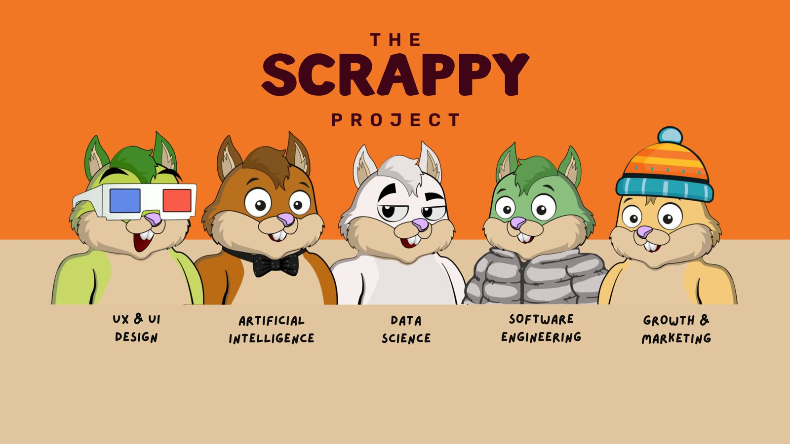
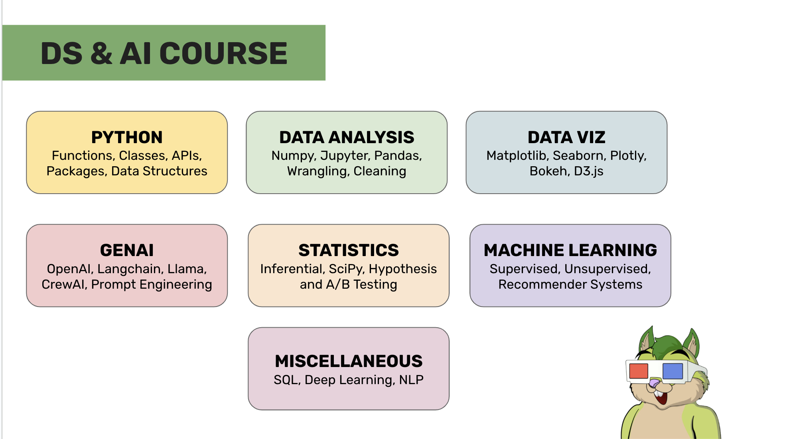
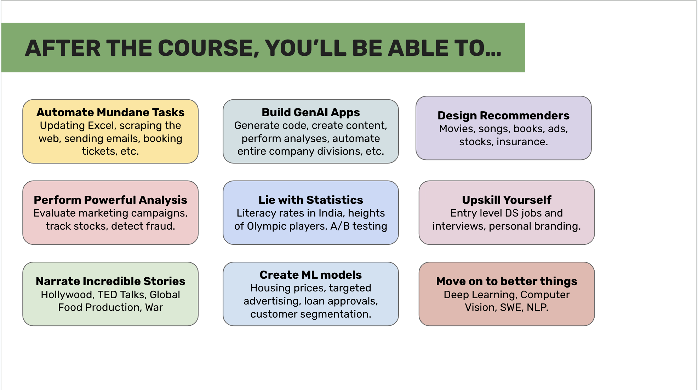

# The Scrappy Project- DS and AI Course

    

## Introduction

Welcome to the official repository of The Scrappy Project's Data Science & Artificial Intelligence course!

The TSP DS & AI course is offered to two cohorts. The *guided cohort* consists of ~40 students and students are expected to participate & complete all course requirements by July 2024 under the mentorship of industry experts.

The *self paced cohort* currently consists of over 100 students but is open to all. Anyone at anytime can follow the instructions in this repository and get started with DS & AI. Once you've independently completed all the requirements of this course, you will be equipped with all the skills required to excel at an entry level data science job at top companies in the world (including FAANG).

Both cohorts are free of cost. You can enrol yourself in the *self paced cohort* anytime but admission to the *guided cohort* is subject to availability and your current technical expertise.

## About The Scrappy Project

*The Scrappy Project* is a spiritual successor to *Scrappy Squirrels*, one of the largest educational blockchain & NFT projects in the world.

Through TSP, the creators envision creating a platform that allows students and working professionals to follow customized pathways in fields such as AI and design under the mentorship of industry experts.

Our pilot program obviously is the DS & AI course with a special emphasis on generative AI that trains data scientists, business analysts, product managers, and entrepreneurs to work with data and be at the cutting edge of what is arguably the most exciting technology of our times.

## Getting Started

This is extremely simple! Simply complete the problem sets, starting from module 0.

Module 0 will set up logistics for you, including granting access to our community and teaching material. Starting module 1, we will cover topics fundamental to data science including the Python programming language, data analysis with pandas, machine learning with sklearn, and so on.

## Syllabus

As stated earlier, this course will teach you everything you need to get started as a career data scientist.

It has also been designed to be supercharge professionals who work with a lot of data (consultants, product managers, entrepreneurs, etc.)

    

Here is a sneakpeek of the things you'll be able to do post the course:

    

## Contributing

TSP DS & AI course is free of cost and open to everyone! Here are a few ways you can contribute to our effort of making data science & AI open and accessible to everyone.

#### Give a talk as a guest speaker

Every few weeks, we invite a guest speaker to conduct a talk/workshop on something topical to AI and data science.

If you are a practicing data scientist with 3+ years of work experience or a leader/entrepreneur working in AI, please do reach out to us for a possibility of collaborating.

#### Share this repository in your circles

You could help us out by giving us a shoutout in your circles and inviting your peers/colleagues to join the course. 

#### Collaborate on content creation and advertising

If you're a tech influencer and you'd like to collaborate on the creation of branded content or advertising, do reach out to us! Please note that given the free nature of this course, we're unable to participate in collaboration that involve payment.

## Contact

For any questions or enquiries, please reach out to instructor@thescrappyproject.co.
