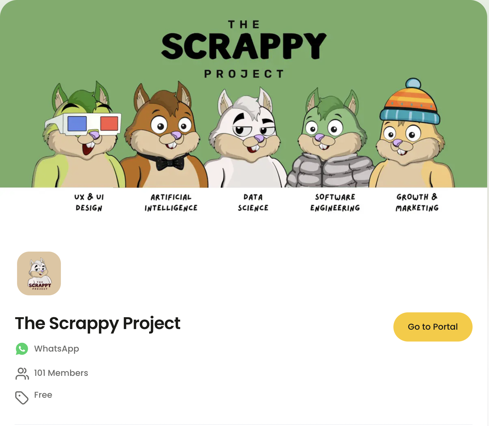
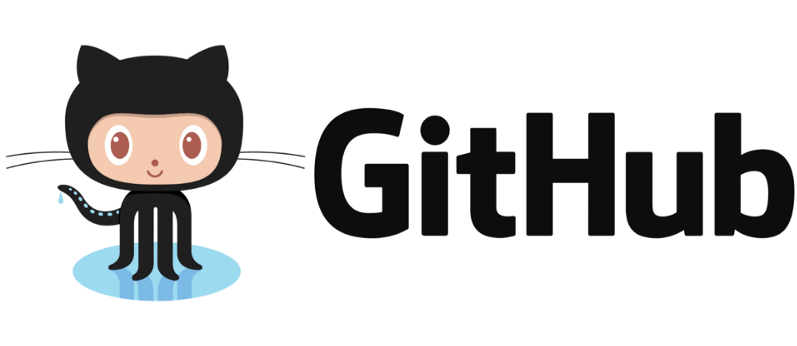

# Problem Set 0

    

## Introduction

Hello, and welcome to the DS & AI course! In this problem set, we will primarily be doing logistics to ensure everything goes smoothly in the subsequent weeks. This is also an opportunity for you to get a headstart on Python programming should you have no experience in it.

Without any further ado, let's begin!

## Setting up Accounts

### Step 1: Join *The Scrappy Project* Nas Community

    

TSP DS & AI course is **free and open to everyone!** To join, simply fill up an application on [Nas](https://nas.io/the-scrappy-project). Post approval, you will be invited to join a WhatsApp group...

### Step 2: Get access to the relevant WhatsApp groups

Our primary mode of communication is going to be WhatsApp. Once you've been approved on Nas, you will receive an invitation to join the *TSP DS/AI All* WhatsApp group which is part of *The Scrappy Project* community.

If you're from the guided cohort, you should also have access to the *TSP DS/AI Guided* group.

Everyone else should request access to the *TSP DS/AI Self-Paced* group.

Note that applications to the guided cohort are currently closed. But we will reopen them should a few spots open up. To make a case, you will have to prove that you've done all the work expected from the cohort up to that point of time. 

**Note:** Do not request access to the *TSP DS/AI Core* group; that is for TAs and instructors only!

To summarize, you will need access to the following groups depending on your cohort:
1. **Guided**: All, Guided and (optionally) Self-Paced
2. **Self-Paced**: All and Self-Paced

### Step 3: Get access to the Live Recordings

Every session conducted as part of the DS & AI course will be recorded. You can then view/revisit them at your leisure. The recordings are hosted on Google Drive and you will find the link pinned to the *All* WhatsApp group.

### Step 4: Watch the Orientation

If you didn't get an opportunity to attend the live orientation session conducted on March 24, 2024 (Sunday), please watch the recording of the session.

The Orientation walks through the rationale for creating this course, the syllabus, ways of working, tips to succeed, and much more. You can also find slides used in this session as a PDF in the `week_0` folder.

### Step 5: Create accounts on Medium and Dev.to

Almost every problem set will involve tasks that will require you to publish and share your work on a public platform. The two platforms that we recommend you post to are [Medium](https://medium.com/) and [dev.to](https://dev.to/). Go ahead and create accounts on these platforms, if you haven't already.

We will be constantly viewing the work you share with us. The articles we like best will be published on *The Scrappy Project* [Medium publication](https://medium.com/the-scrappy-project). Definitely give us a follow, and keep track of amazing content produced by fellow students.

### Step 6: Create an account on Kaggle

Kaggle is the largest online community of data scientists and AI researchers. We will be using Kaggle extensively to download datasets, read notebooks, participate in competitions and also contribute along the same lines.

You can create a free account on Kaggle [here](https://www.kaggle.com/). Once you have an account, take some time to visit the [datasets](https://www.kaggle.com/datasets) page and search for datasets you might be interested in analyzing or building models out of. It's completely okay if you don't know how to do either of those things; that's the entire purpose of this course. All we're asking is to find out if there are datasets in subjects or fields you have a particular interest in (such as sports or movies).

Also, while you're there, [do give your instructor a follow](https://www.kaggle.com/rounakbanik)!

### Step 7: Install git on your local system

Git is a version control system we will be using extensively. The document that you're reading right now, and the project that it is a part of is all being controlled by git.

Any serious organization requires its software engineers, data scientists and even product managers to work on git (or a similar version control system). It's a must-have skill and is something we will ensure becomes second nature to you by the end of this course.

For the time being, you can install git locally for your machine using the instructions available [here](https://git-scm.com/book/en/v2/Getting-Started-Installing-Git).

### Step 8: Create a GitHub Account

    

Unless you've been living under a rock, you've probably heard of [GitHub](https://github.com). It's a platform that hosts git projects (or repositories). This document and the project it is contained in are hosted on GitHub and chances are you're viewing this on GitHub too.

Go ahead and create a free account on GitHub [here](https://github.com).

Once you've created an account, make sure you star the [DS & AI repository](https://github.com/The-Scrappy-Project/tsp_dsai). 

### Step 9: Install VS Code on your local system

In order to write and run code, we will require a code editor. The one that we will be using in this course and strongly recommend thay you use too is Visual Studio Code. It is free to download and is available [here](https://code.visualstudio.com/download).

## Task: Create a study group

As you induct yourself into this course, we require that you find 2-3 other students to form a study group with. This group will have two main purposes:
1. To keep everyone accountable on the progress you're making in the course
2. Peer review on problem sets
3. Work together on projects where group work is allowed (including the Capstone)

Study groups are mandatory for the Guided cohort. Post orientation, an Excel sheet will be made available where you need to inform us about your group and its participants.

Although not required, it is strongly recommended that students in the self-paced cohort also organize themselves into study groups and hold each other accountable. The amount of instructor feedback for this cohort is going to be limited so we suggest you overindex on peer review. A separate Excel sheet will be shared on the *Self Paced* WhatsApp group containing list of people looking for groups.

## Week 0 Project

### Step 1: Create an empty GitHub repository

In this project, you will be creating your very first GitHub repository. This will involve the following steps:

1. Create a project on your local machine
2. Initialize git in the aforementioned project
3. Create an empty repository on GitHub
4. Push your local project to the GitHub repository

### Step 2: Create a README markdown file

Once you've pushed this empty repository, you will then proceed to create a README.md file. As the extension suggests, this file will be in a markdown format.

This file should have the following content:
1. A title
2. Your favorite GIF
3. A brief description about yourself and what you wish to achieve in this course

### Step 3: Create a `week_0` folder and a markdown document 

The markdown document should list Kaggle datasets you found interesting and analysis/models you'd like to build on top of them. Don't worry if you don't know how to go about doing said analysis; be creative, be ambitious. You and I together will figure out how to bring your great ideas to life :)

### Materials

If you're feeling overwhelmed by the amount of terminology being thrown at you, fret not! Go through the following resources if you're inexperienced in git, markdown, or both.

1. [Git and GitHub tutorial for beginners](https://www.youtube.com/watch?v=tRZGeaHPoaw)
2. [Markdown Tutorial](https://www.markdowntutorial.com/)

The first office hour will involve a session where we walk you through both of these tools. If you still feel like you need more help, do not hesitate to reach out on WhatsApp! Git is notorious for not being very user friendly so it's totally okay if it goes over your head the first few times. It did for us!

## (Optional) Get a head start on Python

    

If you do not have any experience programming in Python, it is a good idea to get a headstart. The following is content that is earmarked for weeks 1 and 2, but go ahead and give yourself an advantage should you think you need it.

1. [Automate the Boring Stuff with Python](https://automatetheboringstuff.com/) by Al Sweigart; Chapters 1-11
2. [Learn Python](https://www.learnpython.org/); topics listed under *Learn the Basics*
3. [Python course by freeCodeCamp](https://www.youtube.com/watch?v=rfscVS0vtbw)

You can choose one of the above options; they all cover the same material. Different people have different tastes for teaching styles. We very strongly prefer option 1 but if you feel option 2 or 3 is better for you, that's okay too.

If you like reading from physical paper, you can get Al Sweigart's book on all major retailers, including [Amazon](https://www.amazon.in/Automate-Boring-Stuff-Python-2nd/dp/1593279922/). If you're more of a video person, there is a course version available on [Udemy](https://www.udemy.com/course/automate/?couponCode=NVDPRODIN35) too.

## Tasks for the week

Deadline for guided cohort: April 8, 2024

- [ ] Join the Nas Community
- [ ] Get Access to WhatsApp groups
- [ ] Go through the Orientation material
- [ ] Create a Medium account
- [ ] Follow *The Scrappy Project* Medium Publication
- [ ] Create a dev.to account
- [ ] Create a Kaggle account
- [ ] Follow Rounak Banik on Kaggle
- [ ] Install git
- [ ] Create a GitHub account
- [ ] Star the TSP DSAI repository
- [ ] Install VS Code
- [ ] Form a study group
- [ ] Create your personal DSAI repository

