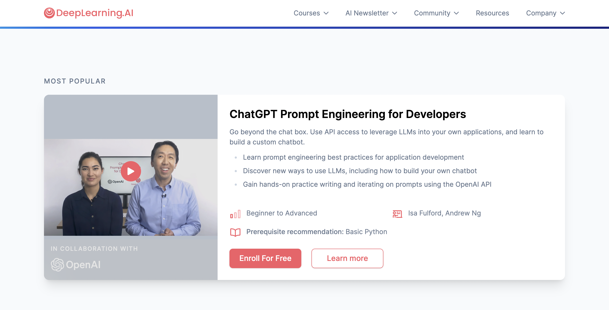

# Problem Set 2: Generative AI & Prompt Engineering

    

## Introduction

Welcome to to problem set 2! This is the first of many generative AI modules that we've planned for this course. This problem set will introduce ChatGPT, the OpenAI API, and basic prompt engineering. If you're from the guided cohort, you're expected to complete this in 3 weeks.

Once you're done with this section, you will be able to:
1. Access OpenAI's powerful models through an API.
2. Design powerful prompts that can execute a variety of tasks including playing games, detecting sentiment, extracting information, generating code, and answering questions.

## Materials

    

To solve this problem set, go through the following 1.5 hour courses on [deeplearning.ai](https://www.deeplearning.ai/short-courses/):
1. [ChatGPT Prompt Engineering for Developers](https://www.deeplearning.ai/short-courses/chatgpt-prompt-engineering-for-developers/) by Isa Fulford and Andrew Ng.
2. [Building Systems with the ChatGPT API](https://www.deeplearning.ai/short-courses/building-systems-with-chatgpt/) by Isa Fulford.

To complement these two courses, you can also use the following documentation and guides:
1. [OpenAI API Documentation](https://platform.openai.com/docs/introduction)- This is obviously a reference for everything you can do with the OpenAI API. If you're new to genAI development, I would strongly recommend going through the [Quickstart](https://platform.openai.com/docs/quickstart) section first.
2. [Prompt Engineering Guide](https://www.promptingguide.ai/)- My go-to resource for learning prompt engineering. As a first step, I would recommend walkting through the [Introduction](https://www.promptingguide.ai/introduction) section of this guide.

Since this is a new topic, I will also be conducting several office hours throughout May covering prompt engineering and getting started with OpenAI. We will also be launching a guide on Prompt Engineering in the coming weeks, so stay tuned!

## Checklist

Before you start with the practice problems, here is a checklist of things you need to complete:
- [ ] Problem Set 0 and Problem Set 1
- [ ] Install the python `openai` package (Hint: use pip and if you're facing trouble, check out the instructions in the Quickstart guide highlighted above)
- [ ] An OpenAI API key (can be obtained from [https://platform.openai.com/](https://platform.openai.com/)).

## Practice Problems

### Problem 1: Ask ChatGPT to plan your dream trip

You are not required to write code for this question. Simply head over to the [ChatGPT web app](https://chat.openai.com/) and write a detailed prompt to plan your dream trip. Be as detailed and specific as you can: which cities/countries you want to visit, how many days, what you're interested in, best times to travel, etc.

Trip planning will be a recurring topic we will cover in future generative AI modules, so any insights you get from this exercise will definitely will be handy!

### Problem 2: Implement a basic QnA bot

Let's start simple. Write a Python script that invokes GPT-3.5 to answer a questions asked by the user. 

For example, if I ask *What is the capital of India?*, your script should tell me that it's *New Delhi*.
If I ask *Who was the first president of the United States?*, the answer should be *George Washington*.

#### Note:

If you ask your function who the Prime Minister of UK is, it'll tell you *Boris Johnson*. However, that is clearly not true. Can you figure out what the reason is? (Chances are, GPT 3.5 will tell you yourself).

### Problem 3: Build the 20Q game

    

From Wikipedia...

*20Q is a computerized game of twenty questions that began as a test in artificial intelligence (AI). It was invented by Robin Burgener in 1988. The game was made handheld by Radica in 2003, but was discontinued in 2011 because Techno Source took the license for 20Q handheld devices.*

*The game 20Q is based on the spoken parlor game known as twenty questions, and is both a website and a handheld device. 20Q asks the player to think of something and will then try to guess what they are thinking of with twenty yes-or-no questions. If it fails to guess in 20 questions, it will ask an additional 5 questions. If it fails to guess even with 25 (or 30) questions, the player is declared the winner. Sometimes the first guess of the object can be asked at question 14.*

Your task is to implement the twenty questions game using ChatGPT. The way this works is you will think of an entity (celebrity, book, movie, etc.) and ChatGPT will have 20 questions or fewer to guess what you're thinking of.

### Problem 4: Metaprogramming

In Problem Set 1, we asked you to write a Python script that downloads xkcd comics and turns them into a PDF comic book. For this problem, you need to accomplish the exact same task but instead of writing the code yourself, you need GPT to come up with the code.

Write a script that prompts GPT to write a correct xkcd program and then execute the program within your script.

### Problem 5: Create a Sentiment Classifier

A sentiment classifier is a machine learning model that takes in a piece of text as an input, and outputs the sentiment of the text: typically positive, negative, or neutral.

Sentiment classifiers are easily one of the most widely used ML models and are deployed across a variety of use cases. Some examples include Amazon giving you a summary of people's feelings about a product, identifying and deleting toxic comments on social media, and judging the sentiment around a movie or album.

Up until very recently, building sentiment classifiers required a massive amount of data and complex deep learning models to perform at an acceptable level.

Your task is to build a classifier such as the one described above without using any data or building any ML models.

## Office Hours

In the office hours related to this module, I'll cover the following:
1. Introduction to generative AI
2. Introduction to OpenAI API
3. Basics of Prompt Engineering
4. Solutions to Practice Problems

## Tasks for the week

Deadline for guided cohort: May 31, 2024

- [ ] Complete practice problems and receive/give peer review

