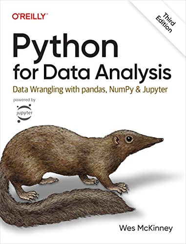

# Problem Set 4: Data Analysis with pandas

<div align="center">
    
</div>

## Introduction

Welcome to problem set 4! In this module, we will cover how to perform data analysis with the pandas library; arguably the most important tool in a data scientist's toolkit. Pandas is used for a wide variety of data science tasks including:

1. **Loading data** from a variety of formats such as CSV, Excel, Markdown, SQL, and JSON.
2. Performing **exploratory data analysis** that is critical in understanding the data you're dealing with, and its strengths and shortcomings.
3. **Cleaning data** by converting columns into the right data type, interpolating or dropping missing data, and removing or replacing outliers.
4. **Transforming data** by performing operations such as sorting, filtering, and joining/merging multiple datasets.
5. **Agrregating data** using functionality of varying complexity from descriptive statistics to pivot tables.
6. Performing basic **data visualization** using simple but powerful graphs (we will cover this in more detail in a subsequent module)
And much, much more.

After you're done with this module, you'll have acquired a skillset that would rival the greatest Excel power users. If you want to make it as a data scientist or a data analyst, it goes without saying that expertise in pandas is mandatory. Hopefully, with the practice you gain from doing this problem set and the accompanying office hour videos, you'll have everything you need to be off to a flying start.

## Materials

<div align="center">
    
</div>

You will need the following material in order to complete this problem set:

1. [Brandon Rhodes- Pandas from the Ground Up- PyCon 2015](https://www.youtube.com/watch?v=5JnMutdy6Fw&t=102s)- I've personally gone through over a dozen books, courses, and videos that cover data analysis with pandas and I've not seen any that come even remotely close to this. This is not just the best pandas tutorial, it is one of the best programming tutorials of all time. In 2.5 hours, Brandon will teach you those parts of pandas that you'll continue using for >90% of your data analysis tasks, possibly for the rest of your career.
2. [Python for Data Analysis](https://a.co/d/0egEquSG)- Authored by the creator of pandas himself, this massive books serves as a good reference to the pandas library and is periodically updated to reflect latest changes in the library as well as the Python programming language. Reading this book is strictly optional though. Beware that you might find this book to be on the heavier side.

## Checklist

Before you start with the practice problems, here is a checklist of things you need to complete:
- [ ] Problem Sets 0-3

## Practice Problems

### Problem 1: Install Jupyter and the Python scientific packages

In order to perform powerful data analysis using Python, you will require a host of scientific packages (including pandas) installed on your local machine, like any other Python package you've installed so far.

You will also be required to install and use Jupyter notebooks to perform data analysis, and complete the subsequent problems in the set. We will go more into what Jupyter notebooks are in the Office Hours. Brandon's tutorial also makes an excellent introduction of it and uses it throughout the tutorial.

There are two primary ways to set up jupyter and the accompanying packages:
1. **Anaconda**: Given that the scientific Python ecosystem comprises of dozens of interdependent tools and packages, [Anaconda](https://www.anaconda.com/) provides a free, easy solution to install everything at once. It also gives access to the helpful `conda` command that is extremely adept at setting up virtual environments and installing packages. You can download the Anaconda distribution for free [here](https://www.anaconda.com/download).
2. **Pip**: The other way, of course, is to use tools we've already installed. Using `pip` won't get you everything all at once but for this tutorial, you can get off to a reasonable start by simply running `pip install notebook pandas`.

My personal preference is for (2). Regardless of how you do it, you should be able to spin up a Jupyter notebook in your browser by running the following terminal command.

```
$ jupyter notebook
```

### Problem 2: Complete exercises 1-5 from Brandon Rhodes' tutorial

This one is fairly simple. As part of the tutorial, Brandon shares a [repository](https://github.com/brandon-rhodes/pycon-pandas-tutorial) that contains 5 exercise notebooks. Your task, therefore, is to complete these five exercises as you follow the tutorial.

### Problem 3: Create the ultimate guide to Pokemon

<div align="center">
    
</div>

Unless you've been living under a rock, you know what *Pokemon* is. You must have either watched the anime where you followed the adventures of Ash and Pikachu, played one of the over 20+ games that have been released on every Nintendo console in the past 25 years, or consumed other media such as trading cards, books, plushies, and songs. It should come as no surprise that *Pokemon*, at the time of writing, is the largest media franchise on the planet.

For this task, you will be using a [Pokemon dataset](https://www.kaggle.com/datasets/rounakbanik/pokemon/data) that contains information on Pokemon from the first 7 generations (i.e Pokemon that existed in or before 2017) and answering the set of questions below. 

You need to answer the following questions by loading the dataset into a Jupyter notebook, and using pandas to perform the required analysis.

Be sure to read the description of the dataset (including the column information) on the dataset's [webpage](https://www.kaggle.com/datasets/rounakbanik/pokemon/data). This will come handy in answering questions that are slightly tricky.

- How many Pokemon exist in the first seven generations? In other words, how many rows does this dataset contain?
- List all the columns that exist in this dataset. How many columns exist? Do you understand what each column means?
- How many genderless Pokemon exist?
- List the top 10 species of Pokemon where the Pokemon are overwhelmingly female.
- List all Pokemon types.
- How many Pokemon have dual types?
- The total base stats of a Pokemon is the sum of its HP, Attack, Special Attack, Defense, Special Defense, and Speed. This is a good proxy for how powerful a Pokemon is. Given this information, find the top 10 most powerful Pokemon by total base stats.
- Find the five most powerful Pokemon that are not legendaries.
- List the 10 lightest Pokemon.
- Generate the descriptive stats for Pokemon weights i.e mean, median, count, min, and max.
- Create a table that has two columns: a Pokemon ability and the number of Pokemon capable of having that ability.
- Which generation has the highest Pokemon? Which has the fewest?
- Create a new column `bmi` that computes the body mass index of each Pokemon. Next, create a dataframe that sorts all Pokemon by BMI.
- Which type combination has the fewest weaknesses?
- List all types that a rock type Pokemon would be weak against.
- List all types that would cause 2x damage to a fire type Pokemon.
- Find all Pokemon that have the dual Water/Ground typing.
- Find the average speed of every type of Pokemon. Which type has the highest average speed?

## Bonus: Update the Pokemon Dataset with eighth and ninth generation Pokemon

The dataset that you used contained information on the first seven generations of Pokemon. It's been over 7 years since thay dataset was released, and there have been two new generations of Pokemon that have added over 200 Pokemon. 

For this option, bonus project, your task is to create a new Pokemon dataset that contains all the information that the aforementioned dataset does but for all nine generations of Pokemon instead of seven. Note that you'll be requiring some of the automation tools and packages from Module 0 for this task. As this does not really involved pandas or data analysis, your participation is optional.

If you do end up creating this dataset, I'm happy to update the dataset above and give you credit for it. You will, in effect, become a co-author of one of the most popular public datasets of all time which is a pretty neat thing to brag about imo.

## Office Hours

In the office hours related to this module, I'll cover the following:
1. A whirlwind tour of pandas' most important functionality
2. Bringing the world of Pokemon to life using pandas

## Tasks for the week

Deadline for guided cohort: August 31, 2024

- [ ] Complete practice problems and receive/give peer review
