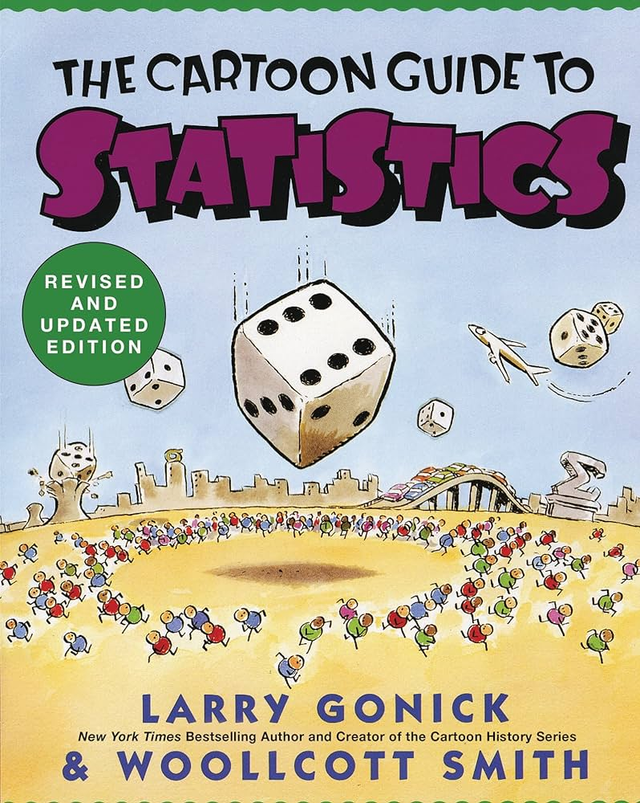

# Problem Set 7: Inferential Statistics

    

## Introduction

Welcome to module 7! In this module, we will cover inferential statistics. This module is more theoretical and math-heavy than all the modules you've seen thus far but it serves as an important precursor to the largest module in the course: *Machine Learning*. The tools and techniques for inferential statistics will be extremely relevant and useful if you work at a job that does a lot of A/B testing or a job involving a lot of social science or economic research.

Most tech-inclined companies in the world make the seemingly smallest of decisions using data-driven techniques and the technique most commonly used is A/B testing. In A/B testing, a company typically launches two slight variations of a product to two groups, and tries to identify if a particular variation is preferred over the other. To be able to prove preference mathematically would require usage of statistical tests that you learn in this module. Here are some questions that companies have answered using A/B testing:

1. On an e-commerce website, should the checkout basket display number of items in the basket?
2. What should the call-to-action button on my website say?
3. Does my redesigned landing page get more conversions?

Similarly, take a look at some of the questions below:
1. Does smoking cause cancer?
2. Are women more likely to book Airbnbs?
3. Does race play a role in determining success in interview callbacks?
4. Does a newly released drug X actually treat a disease Y?

All these questions too are answered through carefully designed trials and statistical tests employed on data collected from said trials.

Without any further ado, let's dive in!

## Materials

    

Unlike most of the other modules you've tackled so far, inferential statistics is more math than computer programming (duh). Consequently, this is one of the few modules you'll spend more time learning theory than writing code. That said, I'm hoping the resources I've listed are something you enjoy as much as programming tutorials that have come before this.

1. [Cartoon Guide to Statistics by Larry Gonick](https://www.amazon.com/Cartoon-Guide-Statistics-Larry-Gonick/dp/0062731025/)- I'm a practicing data scientist and have taken multiple courses on statistics but this is the best beginner-friendly primer I've ever come across. Although it's 200 pages, the entire book is designed like a comic and you should be able to breeze past it in 2-3 hours. Considering the alternatives are 14-week courses on edX or 1000-page Statistics textbooks that will put you to sleep in 15 minutes, I think this option is not bad at all.
2. [Inferential Statistics with Python notebooks](https://github.com/rounakbanik/inferential_stats_pycon)- Unfortunately, there aren't a lot of courses I'm aware of that are free and teach how to apply inferential statistics in Python. Compared to machine learning, these tools are not that commonly used. Therefore, I've shared a few notebooks that I had created as part of a SciPy conference talk in 2017. These notebooks will give you a tour of applied statistics in Python and teach you how to conduct statistical tests. You can read through these notebooks yourself or attend the workshop that will be conducted during office hours.

## Checklist

Before you start with the practice problems, here is a checklist of things you need to complete:
- [ ] Problem Sets 0-6

## Practice Problems

### Problem 1: A/B Testing Website Redesign

    

You are a data scientist at a startup and your CEO has decided to revamp the design of your website. She's undertaken this initiative as she felt that the design change would lead to more conversions.

To test this, your company's software engineers have randomly pushed the old design to a few visitors and the new design to the rest. They've collected data on if the visitor to the website in a particular design converted or not.

The data is available as a [Kaggle dataset](https://www.kaggle.com/datasets/zhangluyuan/ab-testing). Conduct an EDA of the dataset and run a statistical test that can conclusively prove/disprove that the new design had an effect on conversions. Set alpha at 5%.

### Problem 2: Racial Discrimination in Job Interviews

In this folder, you will find a dataset `race.csv` that was created by scientists as part of an article[Are Emily and Greg More Employable Than Lakisha and Jamal? A Field Experiment on Labor Market Discrimination](https://www.aeaweb.org/articles?id=10.1257/0002828042002561) published in the American Economic Review.

Perform a detailed EDA of this dataset. Next, find out if race plays a role in job interview callbacks. In other words, is a black person equally likely to get invited to an interview than a white person? Answer this question using two tests:
1. T-Test
2. Chi-Square Significance Test

You should arrive at the same p-value and conclusion regardless of the test. Set alpha at 1%.

## Office Hours

In the office hours related to this module, I'll cover the following:
1. Workshop on inferential statistics with Python.
2. Solution approaches to practice problems.

## Tasks for the week

Deadline for guided cohort: October 31, 2024

- [ ] Complete practice problems and receive/give peer review