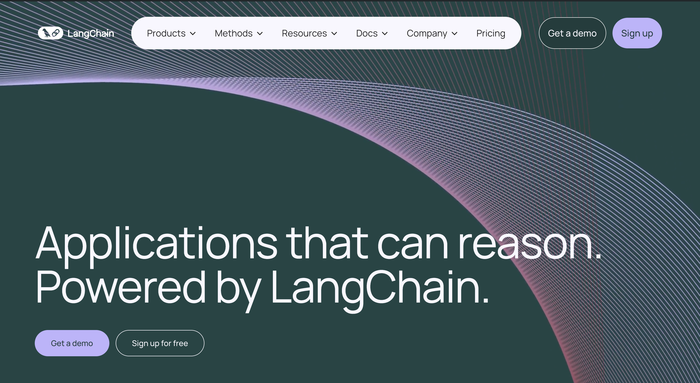
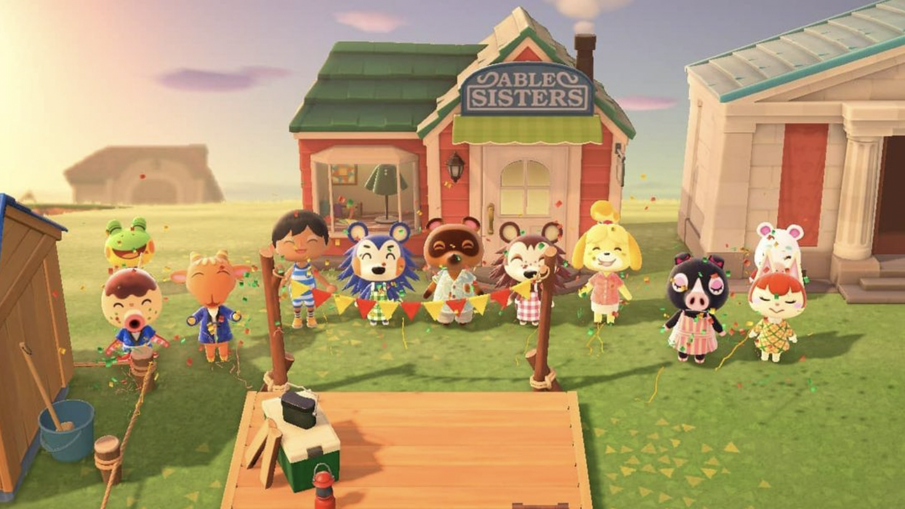

# Problem Set 9: GenAI Application Development

    

## Introduction

Welcome to the third and final module on Generative AI! In this module, we will discover techniques to build powerful GenAI applications using state-of-the-art tools such as LangChain. We will focus on one particular framework called *retrieval augmented generation* or RAG, that is easily the most popular GenAI system design in use today. You've already encountered RAGs in module 3, when you built a system to query SQL databases. We will dive into more complex ideas in this module.

Post this problem set, you will be able to create full-blown GenAI applications that wow employers and investors. You'll also be well-equipped to reverse-engineer flagship products of some of the most exciting AI startups in the world today (and maybe even start something of your own). Let's get started!

## A Few Notes on RAG

    

Retrieval augmented generation is a rapidly evolving field so much so that what may be considered groundbreaking today may become hopelessly outdated in a span of few months. That said, at its core, it's solving a simple problem: leveraging (mostly public) LLMs to process private data.

Think about the times you've used ChatGPT or a similar LLM service. These services are exception at providing answers to questions that can be answered using public data sources. For instance, if you asked GPT to summarize the *Myth of Sisyphus* or list the first 15 US Presidents, it'll do it with extreme ease. However, asking something like *how many users visited my website today and what did they look at most?* is a question it cannot possibly answer because the data required to do so is private and confidential.

Therefore, all RAG does, despite its fancy name, is intelligently extract data that might be useful to answer a question, and pass the data + question to an LLM to get a final answer. As we've seen in the *prompt engineering* module, this is something that an LLM is exceptional at as well. 

The RAG system you design will be heavily dependent on the data that needs to be extracted. Typically, you would classify them into two buckets:
1. **Structured data** mostly consisting of databases (SQL, NoSQL, etc.) and structured data files such as CSV and Excel.
2. **Unstructured data** consisting of everything else. These include PDFs, images, presentations, audio recordings, and videos. 

Possibly the most challenging part of RAG applications is structuring/engineering data into a format that is usable by the remaining components of your system, including the LLM. Therefore, RAG applications are more an exercise in *data engineering* than *data science*. In the practice problems that you'll do as part of this module, I've deliberately added in a few data engineering tasks in order to simulate what building these systems in real-life will look like.

## Materials

    

For this module, I'm going to heavily rely on [deeplearning](https://www.deeplearning.ai/courses/) short courses (like I did with the other two GenAI modules). Founded by the legendary Stanford professor, Andrew Ng, the platform has partnered with virtually every major AI player and created short, digestible courses on how to create GenAI applications of every flavor.

In order to tackle this module, I'd suggest going through the following courses (in addition to the courses listed in module 2):
1. [LangChain for LLM Application Development](https://www.deeplearning.ai/short-courses/langchain-for-llm-application-development/): This course, instructed by the creator of LangChain himself, will teach you how to use the library to create cutting-edge GenAI applications. You will learn concepts such as prompt formatting and parsing, chaining calls, agents, and document QnA. This course will serve as a foundation for any advanced app that you may build using GenAI.
2. [LangChain: Chat with Your Data](https://www.deeplearning.ai/short-courses/langchain-chat-with-your-data/): This course dives deeper into the retrieval augmented generation usecase and teaches you how to build chatbots that can answer questions about your data.
3. [Functions, Tools, and Agents with LangChain](https://www.deeplearning.ai/short-courses/functions-tools-agents-langchain/): This course covers more advanced topics in LangChain (and LLMs), such as function calling, which is the foundation of the powerful agents and crews you encountered in module 7.

I think the aforementioned courses should be more than enough to get you started on the practice problems. But feel free to take up any of the other courses on a topic you might be struggling with. For instance, I'd recommend the [Chroma course](https://www.deeplearning.ai/short-courses/advanced-retrieval-for-ai/) if you are interested in learning more about vector databases and their capabilities.

Finally, here are a few articles that you might find useful as well. 
1. [Embeddings and Vector Databases with ChromaDB](https://realpython.com/chromadb-vector-database/)
2. [Build an LLM RAG Chatbot with LangChain](https://realpython.com/build-llm-rag-chatbot-with-langchain/)

## Checklist

Before you start with the practice problems, here is a checklist of things you need to complete:
- [ ] Problem Sets 0-8
- [ ] Mini Capstone Project

## Practice Problems

### Problem 1: QnA Bot that answers questions about a PDF file

In this problem, you're given a PDF file, [Netflix Goes to Bollywood](https://mitsloan.mit.edu/teaching-resources-library/netflix-goes-to-bollywood), a business school case study made available for free by MIT Sloan. Your task is to build a bot that can answer questions using this file. If the question cannot be answered using the file, your bot must say that it does not know or the information does not exist.

Here are a few sample inputs and outputs.

**Q:** How many paid subscribers did Netflix have in 2019?
**A:** Netflix had over 167 million paid subscribers around the world in 2019.

**Q:** Who is the current president of France?
**A:** This question cannot be answered using the PDF file given.

#### Bonus: Create a Streamlit app for your app

[Streamlit](https://streamlit.io/) allows you to convert your Python scripts into web apps with no prior web development experience required. Streamlit has become especially popular in demoing GenAI prototypes so much so that they have [a dedicated page with code snippets](https://streamlit.io/generative-ai) on their website.

For bonus credit, can you create a Streamlit app where I can upload any PDF document and ask questions about it?

### Problem 2: Animal Crossing New Horizons Catalog

    

[Animal Crossing: New Horizons](https://animalcrossing.nintendo.com/new-horizons/) is a social-simulation game launched by Nintendo in 2020. Although the franchise has been successful for the 2 decades its been in existence, it became a global phenomenon during COVID as people set out to create their own vacation island, and hoard as many kinds of items as possible. I was one such person too and I've spent over 100 hours on the game. The image you see above is a photograph we took to commemorate the launch of new shop (can you spot me?).

As stated above, the game is mainly about hoarding items and using them to decorate your space. Items were extremely diverse, including fossils, statues, paintings, fruits, fish, recipes, villagers, etc. [A dataset cataloging all the items](https://www.kaggle.com/datasets/jessicali9530/animal-crossing-new-horizons-nookplaza-dataset?select=shoes.csv) in the game was published on Kaggle and has gone on to become the most popular Kaggle dataset of all time.

We will be working with this dataset in this problem. You will notice that the dataset contains a large number of CSV files, each cataloging a distinct type of item. For this exercise, you will use only the following CSVs:
1. Villagers
2. Fish
3. Painting
4. Insects
5. Other

Your objective is to design a chatbot that can answer questions using the datasets listed above. Examples:

**Q:** What artwork is the academic painting based on?
**A:** Both the genuine and fake versions of the academic painting are based on *The Vitruvian Man*

**Q:** How much can you sell an Archelon skull for?
**A:** An Archelon skull can be sold for 3500.

In order to build this system, you will do the following:
1. Clean the datasets (you will notice that the column names in some datasets are not correct)
2. Create an SQLite database and convert each file above into a SQLite table.
3. Design a RAG system that can identify intent of the question (i.e which table contains the answer), construct an SQL query for that partiular table, and then use the response to provide a final answer in plain, conversational English.

**Hints:**
1. Don't pass in all the tables at once and ask the LLM to deduce what table to use + the SQL query all in one ago. Instead, consider breaking these steps. This is critical to making your system scalable. You might be able to pass in 5 datasets now but if you have 25 massiva tables, it becomes no longer possible.
2. Consider creating data dictionaries for your tables if you think the column names/values won't be obvious to the LLM. You can also try renaming columns to make them more explicit in meaning.

## Office Hours

In the office hours related to this module, I'll cover the following:
1. Designing a RAG system from scratch.
2. Solution approaches to practice problems.

## Tasks for the week

Deadline for guided cohort: October 31, 2024

- [ ] Complete practice problems and receive/give peer review