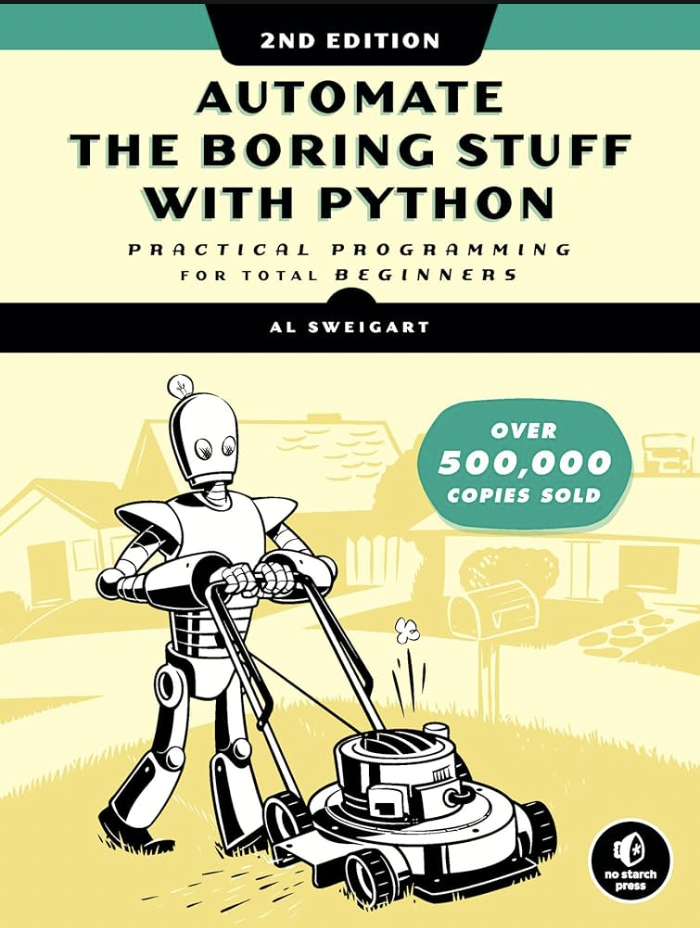
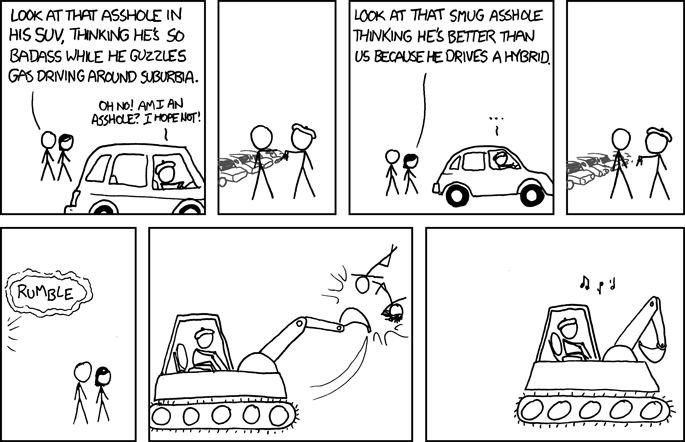

# Problem Set 1: Python

## Introduction

Hello, and welcome to problem set 1! This module will serve as an introduction to Python (and programming in general). If you're from the guided cohort, you are expected to complete this section in 2 weeks.

Once you're done with this section, you will be able to:
1. Understand what programming is, and think like a programmer.
2. Write Python programs to automate everyday tasks, build web apps, create games, etc.
3. Move on to bigger and better things such as generative AI and data science.

## Materials

<div align="center">
    
</div>

To solve this problem set, you can use one of the following resources:
1. [Automate the Boring Stuff with Python](https://automatetheboringstuff.com/) by Al Sweigart; Chapters 1-11
2. [Learn Python](https://www.learnpython.org/); topics listed under *Learn the Basics*
3. [Python course by freeCodeCamp](https://www.youtube.com/watch?v=rfscVS0vtbw)

Although they all largely cover the same material, I have a strong preference for option 1. I've been learning, teaching, and using Python for close to a decade now, and Al Sweigart's book, in my opinion, is the best introduction to Python programming, especially for people without a background in engineering or computer science.

If you like reading from physical paper, you can get Al Sweigart's book on all major retailers, including [Amazon](https://www.amazon.in/Automate-Boring-Stuff-Python-2nd/dp/1593279922/). If you're more of a video person, there is a course version available on [Udemy](https://www.udemy.com/course/automate/?couponCode=NVDPRODIN35) too.

## (Optional) Take Harvard's CS50 class

<div align="center">
    
</div>

If you aspire to be a data scientist or a machine learning engineer in the long term, it is not a bad idea to get a firm grasp of computer science fundamentals (provided you don't have one already).

There are plenty of amazing courses and books on introductory computer science but by far, the best one I've seen is [Harvard University's CS50 course taught by David Malan](https://pll.harvard.edu/course/cs50-introduction-computer-science). This course is so good that I took it twice, once in 2014 and once in 2020. In fact, one of my inspirations for starting *The Scrappy Project* is CS50.

CS50 covers topics beyond what is required for this introductory course on data science (such as algorithms, C, HTML & CSS, Cybersecurity, web development, etc). However, it is worth investing the 12 or so weeks required to complete the course, should you have the time. That said, you won't be at a disadvantage if you don't; simply completing the required components of this course is sufficient to get you to the end.

## (Optional) Take Stanford's Code in Place

<div align="center">
    
</div>

If you're looking for an extensive, teacher-led course focused exclusively on Python programming, consider applying to Stanford's [Code In Place](https://codeinplace.stanford.edu/) class. Like with CS50, taking this class is strictly optional and it covers topics that you don't really need to excel at this course.

## Practice Problems

The best way to get good at Python programming is by writing lots of programs. Once you've gone through the required materials above, solve the problems below. The problems are of increasing complexity, so I suggest you do them chronologically.

If you already have experience programming in Python, feel free to skip this section.

### Problem 1: Add two numbers

Let's start off with a simple one. Write a Python function that adds two numbers. 

For example, `my_func(2, 10)` should return 12.

### Problem 2: Add n numbers

Now, write a function that takes in an arbitrary number of arguments and returns their sum.

For instance, `my_func(2, 3)` would return 5, `my_func(5, 1, 4)` would return 10, and so on.

Hint: Google `*args` in Python and what they can do.

### Problem 3: Factorial of a number

I'm sure you must have heard of factorials. Mathematically, they're defined as follows:

```
n! = n x (n-1) x (n-2) x ... x 2 x 1
```

So 1! is 1, 2! is 2, 5! is 120, and so on. You need to write a program that takes in a single argument, and prints the factorial of the number.

For instance, `my_func(4)` would output 24 and `my_func(3)` would output 6.

### Problem 4: Temperature converter

Write a function that converts celsius to fahrenheit, and vice versa.

The formulae are as follows:
- Fahrenheit to Celsius: (F - 32) * 5/9
- Celsius to Fahrenheit: (C * 9/5) + 32

Your function should take 2 arguments: a temperature and the scale the temperature needs to be converted to.

For instance, `my_func(100, 'F')` would assume that 100 is in Celsius and would convert it to 212F (in other words, it would return 212). On the other hand `my_func(100, 'C')` would assume 100 is in Fahrenheir and would convert it to 37.7C. 

You can assume that the second argument of your function will always be either `C` or `F`.

### Problem 5: List Manipulation

Write a function that takes in a list of numbers as input and performs the following operations sequentially:
- Remove all odd numbers
- Double every remaining number
- Sum all the modified numbers

There is one caveat here though: you're not allowed to use loops! If you feel like you don't know how to proceed, maybe googling *List Comprehension in Python* might help :)

As an example, `my_func([1, 2, 3, 4, 5])` would remove all odd numbers to create `[2, 4]`, double the numbers to create `[4, 8]` and then return a final answer of `12`.

### Problem 6: Patterns I

Write a function that takes in a number, and prints out a pattern.

If the number is 1, you should print out:

```
*
```

If it's 2, you should print out,

```
* 
**
```

If it's 5, the result should be 

```
*
**
***
****
*****
```

And so on.

### Problem 7: Patterns II

Write a function that creates the mirror image of the pattern created in the last problem.

The pattern when n=1 remains the same.

For n=2,

```
 *
**
```

For n=5,

```
    *
   **
  ***
 **** 
*****
```

And so on.

### Problem 8: Word Frequency

Write a function that takes in a string as a function and returns a dictionary of alphabet frequency in the string. Your function should ignore all characters apart from English uppercase and lowercase alphabets.

For instance, `my_func("Hello World! 123")` should return `{'h': 1, 'e': 1, 'l': 3, 'o': 2, 'w': 1, 'r': 1, 'd': 1}`.

### Mode of Submission

In the project repository you created as part of Problem Set 0, create a folder named `week_1`. Within this folder, create another folder named `practice_problems` and populate it with your solutions, one Python file per problem.

**These problems are to be peer-reviewed in your study group.**

## Challenge Problems

Alright now let's move on to bigger things. Solve the two problems below. They're mandatory for the guided cohort, regardless of your Python experience.

### Challenge 1: Compute 1000! using long multiplication

**Update:** We checked and turns out Python can actually compute 1000! natively! We still encourage you to write code that implements the long multiplication technique taught in primary schools.

In one of the problems in the previous section, you were asked to write a function that computes the factorial of a number. However, that function is only good for relatively small numbers. Factorials have a tendency to grow extremely rapidly such even 20! is more than 2 billion billion!

Even the most powerful supercomputer in the world will not be able to compute 1000! the normal way. The number is enormous; it has close to 2500 digits!

Your first challenge is to figure out a clever way to compute this number anyway.

**Hint:** If you had to compute this by hand, it wouldn't be *that difficult*. You would probably need a few hours and a really, really long piece of paper. Can you write a program that mimics multiplication by hand?

### Challenge 2: Create an xkcd comic book

<div align="center">
    
</div>

xkcd is one of my favorite webcomics of all time. Created by Randall Munroe, it tends to cover topics related to programming, math, philosophy, and culture.

xkcd comics are [available for free](https://xkcd.com) online. For this challenge, you have to write a script that downloads every xkcd comic strip ever created and converted into a PDF book (for personal consumption, of course).

This task will require the usage of Python packages like `requests` so feel free to Google and discover what you might need.

### Challenge 3: Find the astronaut Scrappy Squirrels

Before Scrappy Project, our team worked on an NFT education project called [Scrappy Squirrels](https://opensea.io/collection/scrappy-squirrels). As part of this project, we had created over 14,000 squirrels generatively. You've already seen a lot of those squirrels in our logos and slides.

Each squirrel has a unique combination of expression, fur, background, and clothes. For this challenge, your task is to identify the IDs of all squirrels that wear an astronaut suit among the first 2000 squirrels.

Each squirrel has a JSON file associated with it. For instance, Scrappy Squirrel #1's JSON can be found at [https://scrappyart.s3.ap-south-1.amazonaws.com/json/1](https://scrappyart.s3.ap-south-1.amazonaws.com/json/1). Similarly, Scrappy Squirrel #2000 can be found at [https://scrappyart.s3.ap-south-1.amazonaws.com/json/5000](https://scrappyart.s3.ap-south-1.amazonaws.com/json/2000).

If you visit this URL on a broswer, you should get output that looks something like this:

```
{"name": "Scrappy Squirrel #250", "description": "Scrappy Squirrels is a collection of 14,000 NFTs on the Ethereum blockchain. Scrappy Squirrels are meant for engineers, designers, and entrepreneurs pushing web3 forward.", "image": "https://scrappyart.s3.ap-south-1.amazonaws.com/images/00250.png", "attributes": [{"trait_type": "Background", "value": "Cyan"}, {"trait_type": "Body", "value": "Purple"}, {"trait_type": "Expressions", "value": "Winking"}, {"trait_type": "Clothes", "value": "Floral Print OverShirt"}]}
```
This is something called a JSON file. Notice how similar it is to a Python dictionary.

If you look closely, there is an image file too. Visiting that URL will show you something like this:

<div align="center">
    
</div>

More importantly, it seems to have information on what clothes it is wearing.

You now need to figure out how to write a script that accesses these 2000 JSON files, parse it into a Python dictionary, and then determine if the squirrel is wearing an astronaut suit.

While you're at it, go ahead and claim a squirrel to be your study group's mascot! 

### Mode of submission

Very similar to practice problems. Create another folder inside `week_1` and submit one file per challenge. This will be peer reviewed too.

## Project: Automate an everyday task with Python

For the project of this module, you are required to write a script that automates something in your personal or professional life. Once you've created a working script, write a blog post on Medium or dev.to (or both), and submit the link to us through WhatsApp.

This project needs to be done individually and not as part of a group.

Some ideas to get you started (please come up with something original for your project though):
1. Check if a YT Music Channel has posted a new song, and download an MP3 version of it.
2. Send an email to yourself everyday containing news, stocks you're interested in, and other things you keep track of in your life.

Chapters 12-20 of Al Sweigart's book should come handy if you're fishing for ideas or are not sure how you'd go about implementing your idea.

Remember that the submission here needs to be a blog post. You don't need to submit code.

## Office Hours

In the office hours related to this module, I'll cover the following:
1. Walkthrough of some automation scripts I've written to make my life easier
2. Scraping the web using Python
3. Solutions to the harder practice problems
4. Approached to the challenge problems

## Tasks for the week

Deadline for guided cohort: April 22, 2024

- [ ] Complete practice problems and receive/give peer review
- [ ] Complete challenge problems and receive/give peer review
- [ ] Claim a Scrappy Squirrel as an avatar for your study group
- [ ] Automate a task in your life using Python