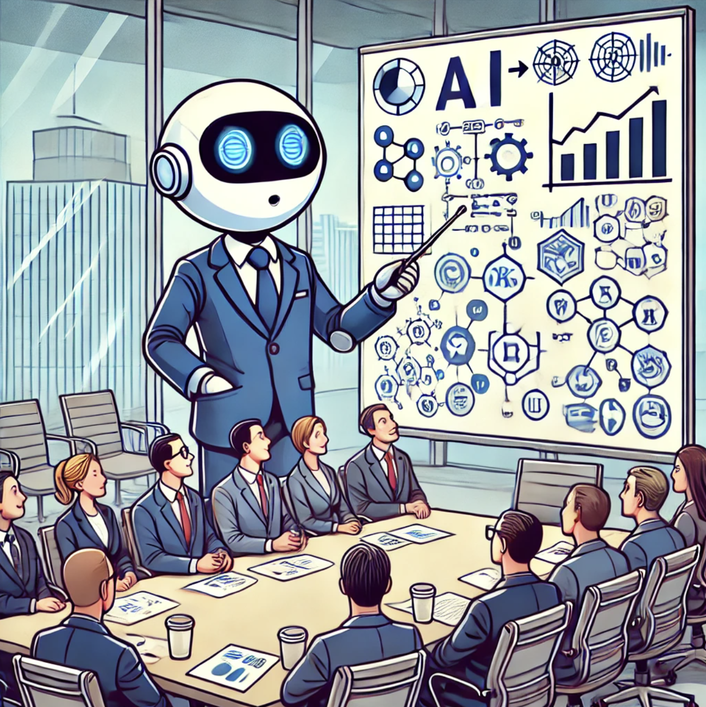

# Problem Set 10: Deep Learning and where to go from here

    

## Introduction

Congratulations on making it to the end of the course! Given that this is a largely self-paced online offering, making it this far stamps you as a top 1% student, so kudos on the feat!

This module will assume a forward-looking view and suggest topics you can dive into post this course. The majortiy of time for this module, however, will be devoted to the final capstone project.

## Materials

Following are topics that I suggest you dive into next using the suggested material below.

### Deep Learning

    

Deep learning, as you may know already, has been the standout technology of the last decade. Today, deep learning is the de facto technology used for any machine learning problem that has to do with computer vision or natural language, from systems that power self-driving cars to all large language models in use today, including Gemini and ChatGPT.

The core idea behind deep learning is that with enough data and sufficiently deep *neural networks*, you can model extremely complex phenomenon. Your training in machine learning from module 8 gives you a strong foundation to dive deep into this topic (in fact, the perceptron can be thought of as the simplest neural network).

There really isn't a shortage for deep learning courses or books but these are the ones that I recommend strongly.
1. **[Practical Deep Learning for Coders: Part 1](https://course.fast.ai/) by fast.ai:** Arguably the most popular deep learning course on the internet. Unlike most resources, this course takes a hands-on approach and teaches you fundamental deep learning concepts through incredible projects (as opposed to heavy theory). A significant chunk of research scientists and deep learning practitioners in the world today begin their journey with this course. If there is just one course you want to do on deep learning that covers everything you need to know, it is this one. If you prefer books, good news! You can leverage [this book](https://a.co/d/1kz4qig) that is based on the course. Part 1 is more than enough to get you started with building state-of-the-art models but should you find yourself interested in doing research and advanced math, consider doing part 2 as well.
2. **[Deep Learning: A Visual Approach](https://a.co/d/9lapWA5) by Andrew Glassner:** I'm a sucker for illustrated books that teach complex topics well and this book is one such gem. Note that if you've completed all the modules thus far, you can skip to chapter 13.
3.  **[NLP Course](https://huggingface.co/learn/nlp-course/chapter1/1) by Hugging Face:** A lot of you have joined this course to learn more about generative AI. And although we've progressed a LOT in terms of building GenAI applications, we haven't really dug too much into the core technology powering it i.e transformers. This course by Hugging Face will get you up to date with the latest of what's possible in natural language processing and LLMs. You will be in an extremely good place to continue original research or toy around with open-source models post this course. (Note that this is an advanced course so you may need to complete (1) or (2) in order to be fully prepared.)

### Explainability

    

While there has been an explosion in interest in black-box deep learning models in the last decade, there has been a similarly strong push for explainable AI.

When you start designing and deploying models as a data scientist in industry, you will quickly realize that leadership is extremely averse to adopting systems that they don't completely understand. Almost no executive is going to be comfortable implementing the recommendations given my a model if he/she is not clear on how the decision was arrived at.

Despite being less than a decade old, SHAP values have become omnipresent in every organization that does any kind of ML. The package used to construct these values is appropriately named `shap` and is relatively easy to use. You can start off with SHAP values and the package [here](https://towardsdatascience.com/using-shap-values-to-explain-how-your-machine-learning-model-works-732b3f40e137) and [here](https://shap.readthedocs.io/en/latest/example_notebooks/overviews/An%20introduction%20to%20explainable%20AI%20with%20Shapley%20values.html)

## Checklist

Before you start with the practice problems, here is a checklist of things you need to complete:
- [ ] Problem Sets 0-9
- [ ] Mini Capstone Project

## Practice Problem

### Create a Hot Dog Classifier

    

[Silicon Valley](https://www.imdb.com/title/tt2575988/) is an HBO comedy TV show created by Mike Judge. It is quite possibly my favorite TV show of all time.

In the show, there is a plotline which involves Jian Yang, a Chinese software engineer, attempting to build a *Shazam for food*. You can watch his demo for the first version of the product [here](https://www.youtube.com/watch?v=vIci3C4JkL0).

Although the cast rips into him for creating something that can only identify hot dogs, the Pakistani software engineer, Dinesh, points out that the underlying piece of tech is extremely powerful. In a hilarious turn of events, Dinesh turns out to be right and Twitter buys Jian Yang out- not to identify hot dogs but flag dick pics.

In this one and only practice problem for this module, you simply have to recreate Jian Yang's hot dog classification model. You can use any deep learning framework of your choice for this but if this is your first time working with vision models, I'd suggest going through lesson 1 of the fastai course, and using the `fastai` library to collect training data and train a model using transfer learning.

## Capstone Project

**In order to graduate and be considered an alum, it is mandatory that you submit a mini-capstone project for review**

It's been a long road and we can finally see the finish point! Your last task for the course is to submit a capstone project that demonstrates the breadth of your data science expertise, and something that you can proudly put in your resume.

You have complete freedom to choose a topic for your capstone project, provided it meets these basic requirements.

1. Your project must start with a clear problem statement and must end with a recommendations section where you communicate results and steps to tackle aforementioned problem.
2. Your project must tackle a problem that a potential recruiter may deem interesting and relevant. Therefore, a project to determine Pokemon base stats are not okay but a project to determine Airbnb booking rates is okay. If you're confused about project topic, please reach out to us on WhatsApp.
3. Toy datasets, Kaggle playground datasets and datasets with less than 1000 rows across files are not allowed.
4. You may choose to pursue a current or expired Kaggle competition as your project. However, as noted earlier, playground competitions don't count.
5. You can create your own dataset if you want. In fact, it is encouraged as you're creating value not just for yourself but for the entire ecosystem.
6. Your project must have an EDA component where you explore the dataset and communicate useful insights (that may inform feature engineering).
7. Your project must perform some kind of modelling: supervised learning, computer vision, natural language processing, recommender systems, etc. You are free to use any package you deem fit.
8. You must submit your project as a public Kaggle notebook.
9. You can work on this project with groups of up to 3.

### Mode of submission

Send your Kaggle notebook over email to [instructor@thescrappyproject.co](mailto:instructor@thescrappyproject.co). Use `Capstone Project: <Member 1> <Member 2> <Member 3>` as your subject line.

**Also, notify us of your submission on WhatsApp. If you don't do this, we can't guarantee that your submission will be evaluated.**

## Office Hours

In the office hours related to this module, I'll cover the following:
1. Building a simple deep learning model with fastai.
2. Constructing SHAP values
3. Topics to dive into post this course.
4. Tips on job hunting, interviewing, and data science careers.

## Tasks for the week

Deadline for guided cohort: December 31, 2024

- [ ] Complete practice problems and receive/give peer review
- [ ] Capstone Project