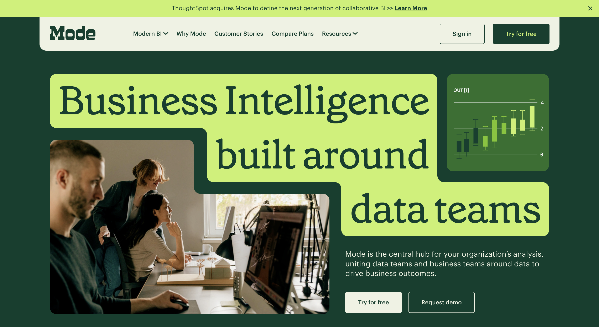

# Problem Set 3: SQL and GenAI RAG Systems

<div align="center">
    
</div>

## Introduction

Welcome to yet another problem set! We will be focusing on SQL (or structured query language) in this module. You will learn what SQL is, why it is important, and how to SQL to extract information from structured databases. In the second half of the module, you will also learn how to leverage GenAI to write SQL statements on your behalf and in the process, build a basic retrieval augmented generation (RAG) system which is all the rage right now, accounting for >50% of GenAI work you may see in the wild.

SQL, like Python, is a language that is computer-readable and used extensively to handle data stored in relational database systems. Unlike Python, it is not a full-blown general purpose programming language that you can use to do anything; instead it's very domain specific.

If you were able to grasp Python, you should have little to no trouble picking up intermediate SQL. On the surface, SQL may appear pretty simple but it is one of the most critical items in a data scientist's toolset and is almost universally required for any data scientist, data analyst and even product management jobs.

In fact, at most of the Big Tech companies like Meta and Google, data scientists can find themselves writing more SQL code than Python. Anecdotally, a lot of data scientist applicants have reported that the SQL interview round tends to be harder than the programming rounds. Therefore, speaking fluent SQL can get you very far and that is what we will strive to achieve in this module.

## Materials

<div align="center">
    
</div>

You will need the following materials in order to complete this problem set:

1. [Basic and Intermediate SQL Tutorial by Mode](https://mode.com/sql-tutorial)- SQL is a pretty old (and extremely robust) language and there are hundreds of books and tutorials available that can help get you started. In our humble opinion, the best free resource available right now is the SQL tutorial by [Mode](https://mode.com/), a data SaaS startup. For this course, completing the basic and intermediate sections are sufficient but if you plan on interviewing with top tech companies for DS roles, it is highly likely they will ask questions covering topics in the Advanced section.
2. [Python sqlite3 documentation](https://docs.python.org/3/library/sqlite3.html)- This reference will come handy when you're trying to understand how to interact with SQL databases using Python.
3. [Replacing a data analyst with ChatGPT](https://patterns.app/blog/2023-01-18-crunchbot-sql-analyst-gpt)- This blog post will give you an insight into how to go about generating SQL statements using ChatGPT.

## Checklist

Before you start with the practice problems, here is a checklist of things you need to complete:
- [ ] Problem Sets 0, 1, and 2
- [ ] Install the python `sqlite3` package
- [ ] An OpenAI API key (can be obtained from [https://platform.openai.com/](https://platform.openai.com/)).

## Practice Problems

### Problem 1: Complete all exercises in Mode's Basic and Intermediate SQL tutorials

This should be pretty simple if you do the tutorial start-to-end. You will also receive a certificate upon completion, and will be able to handle 95% of SQL tasks that are required of data scientists in most organizations.

### Problem 2: Write a Python Script to connect to an SQLite database and run SQL queries

In this folder, you will find an SQLite database called `movies.sqlite` that contains two tables: one containing metadata about movies such as title, release date, revenue, cost, etc. and another containing information about directors.

Your task is to use the `sqlite3` package and write a Python script that connects to this database, and uses SQL statements to answer the following questions:
1. List the top 10 highest grossing films
2. List the top 5 directors with the highest average movie revenue

Note that the SQL statements should be fairly simple to write. This problem is testing your ability to work with SQL through Python than it is your SQL knowledge.

## Mini Project- Build a RAG System

RAG stands for retrieval augmented generation and is arguably the most popular use case in generative AI at the time of writing. Most of the GenAI startups that you see around you are doing RAG underneath the surface.

Although the term sounds fancy, the concept is pretty simple. RAG typically consists of systems capable of answering natural language questions using structured and unstructured data.

Imagine a startup like Doordash or Airbnb that has a lot of data available internally that it can use to drive business intelligence. Now imagine there is a product manager who would like to understand the top 10 US states that bring in the most revenue. To answer, the PM would have to write an SQL statement against the relevant database (or get a data analyst to do it) and analyze the response.

Now imagine a world where we could build a system where the PM could directly ask the question in natural English, and the system would automatically figure out how to the right information, and present the final answer in plain English. This, in essence, is the fundamental promise of RAG systems: the ability to get quick and accurate answers from internal and external data sources without having dependency on a data analyst.

For this mini project, you will build a system that leverages the same `movies.sqlite` database and answers questions that we may have about movies.

Your program should prompt me to ask a question such as:

```
Which is the highest grossing movie?
```

And it should be able to answer the question using the database like:

```
The highest grossing movie is Avatar.
```

Your program should only answer the question using the data available in the database, and should not resort to outside information. The database we have provided you is from 2017 so if we ask a question about a later movie like *Oppenheimer* or *Barbie*, your program should say that it does not know the answer.

You are NOT allowed to write any SQL statements yourself that may answer any of the example questions above. However, writing SQL statements that have to do with schema, listing tables, etc. are permitted.

## Office Hours

In the office hours related to this module, I'll cover the following:
1. Introduction to SQL
2. Approaching building a simple RAG system

## Tasks for the week

Deadline for guided cohort: August 31, 2024

- [ ] Complete practice problems and receive/give peer review
- [ ] Complete mini project


