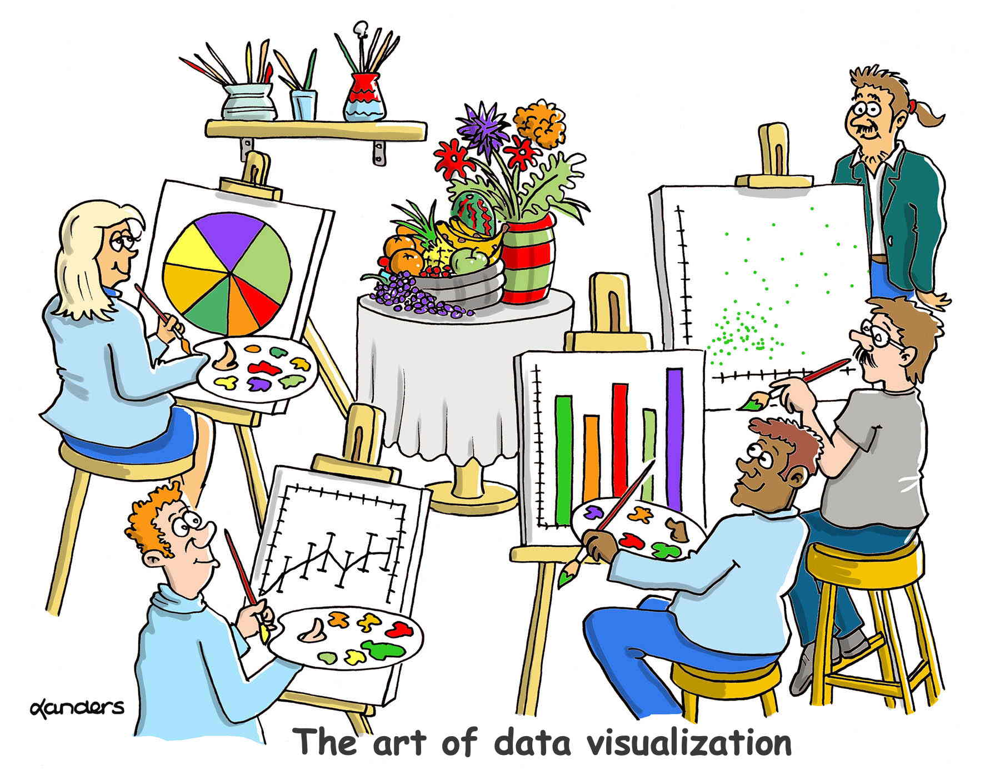
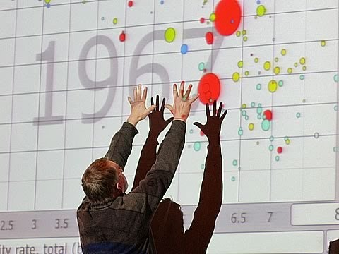
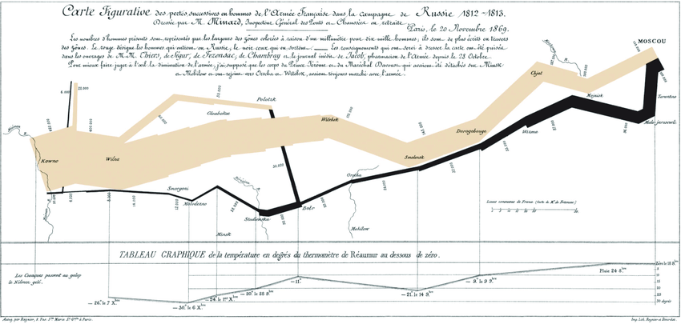
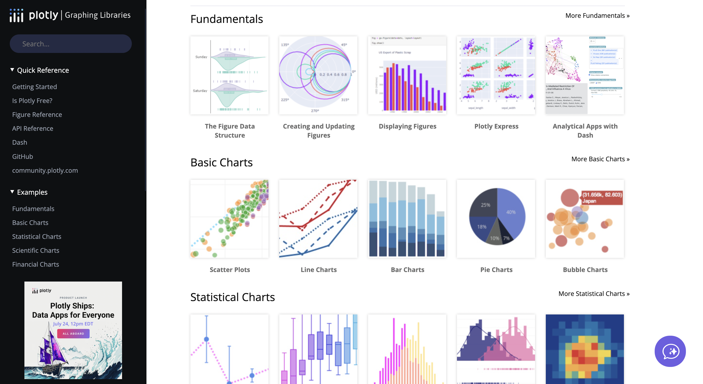
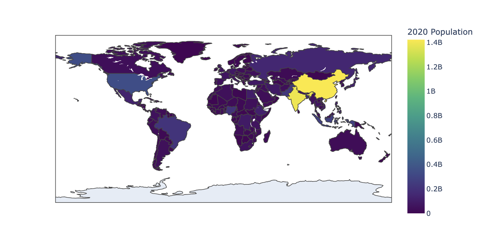

# Problem Set 5: Data Visualization

    

## Introduction

Congratulations on making it to the halfway point and welcome to module 5! This module will cover data visualization basics and powerful plotting libraries available in Python. As you will notice very quickly, data visualization and data analysis go hand-in-hand so this is effectively an extension of the previous module.

In this module, we will strive to achieve the following:
1. Master **data visualization basics** and why graphs are a powerful tool of persuasion and discovery.
2. Survey **popular graphs used to summarize and visualize data** such as histograms, scatterplots, lineplots, heatmaps, and box plots. Evaluate their advantages and shortcomings, and develop the skill to know which graph to use in what situations.
3. Learn how to plot aforementioned graphs using powerful data visualization tools such as **pandas, matplotlib, seaborn, and plotly**.

Personally, this is easily my favorite module. It is while learning the concepts in this module that I truly appreciated the power of data, and made a decision to pursue a career in it. I hope at least some of you will share this sentiment with me once you're done with this problem set.

## Materials

In most of the other modules, I've given you a set of materials that you can look at in the order of your choosing. I'm going to make an exception for this module, and ask that you go through the materials in order. The ones that are optional will be marked so, and you can choose to skip them if you wish.

    

 

To start off, we will watch two of the best TED talks ever on visualization.
1. [The beauty of data visualization](https://www.ted.com/talks/david_mccandless_the_beauty_of_data_visualization?subtitle=en) by David McCandless: In this talk, you will watch journalist Dave McCandless give you tips on how to turn immensely complex data sets into simple diagrams that tease out unseen patterns and connections.
2. [The best stats you've ever seen](https://www.ted.com/talks/hans_rosling_the_best_stats_you_ve_ever_seen?subtitle=en) by Hans Rosling: Disguised as a presentation on global heath and economics, this talk by the late Hans Rosling, one of the greatest statsiticians and data visualization experts of all time, will again give you insights into how to use graphs to make powerful arguments.

 

    

 

Next, watch these lectures from Harvard's CS 109 course on Data Science. These recordings are close to 10 years old but the way they explain data analysis and visualization theory is impeccable and in my opinion, better than the edX version of the course they sell today.

(Note that at the time of publishing the problem set, the lectures were available for free on YouTube. However, they are not posted by an official Harvard University channel. In the off-chance they're removed sometime in the future, reach out to us so we can help you with a solution).

1. [Lecture 2- Exploratory Data Analysis](https://www.youtube.com/watch?v=83DaZ5s8Gbk): This lecture will establish a strong foundation for exploratory data analysis, and introduce foundational plots such as the histogram and the scatterplot. It will also show you how to plot data directly using pandas; something thayt we glanced over in the last module.
2. [Lecture 3- Viz Goals, Data Types and Statistical Graphs](https://www.youtube.com/watch?v=H3U7gjB77Ek): This lecture will walk you through the history of data visualization, and lay down a strong foudation for the visual analytics process. You will explore data types, standard charts, how to go about choosing the right chart, and how to plot univariate, bivariate and multivariate data.
3. [Lecture 4- Visual Attributes, Color and Design Principles](https://www.youtube.com/watch?v=O2BWiv2PnbU): Building on his foundational lecture on data visualization, Marc Streit explores advanced data visualization and design principles in this lecture.
4. [Lecture 5- Visualization of Multi Dimensional Data, Maps and Text](https://www.youtube.com/watch?v=6WYof9Ns1xI): As the ttle suggests, this lecture covers visualization technqiues for data beyond what is available in structured tables, specifically maps and text. Full disclosure: you will probably not use most of the graphs and techniques highlighted here but it's still a good idea to know what's available in your charting catalog.

 

    

 

Once you've grasped the fundamentals of data visualization, writing code to generate the graph of your choice is actually the easy part. Python has powerful yet incredibly easy-to-use plotting libraries to create every kind of chart you could possibly want. The three main libraries commonly used are:
1. **matplotlib**: The foundational plotting library in Python. Most other libraries, such as pandas and seaborn, use matplotlib under the hood to plot graphs.
2. **seaborn**: Built on top of matplotlib, seaborn makes it extremely easy to create complex and beautiful graphs in a few lines of code, abstracting away a lot of details that its parent library, matplotlib, requires.
3. **plotly**: Plotly is a repository of open source graphing libraries used to create interactive charts and maps in a variety of languages such as Python, Julia, and R. 

In most cases, if you're building a static graphs, you will use seaborn or matplotlib, and if you're creating interactive charts, you will use plotly.

Personally, I don't think you need to go through tutorials or courses in order to use these libraries; their documentation is sufficient. That said, if you're looking for a starting point, take a look at the following articles (optional):

1. [Introduction to plotting with matplotlib in Python](https://www.datacamp.com/tutorial/matplotlib-tutorial-python)
2. [An introduction to seaborn](https://seaborn.pydata.org/tutorial/introduction.html)
3. [Getting Started with Plotly in Python](https://plotly.com/python/getting-started/)

### Note on other visualization tools

There are a lot of data science and data analyst jobs that require ability to create graphs using Excel or Tableau. The latter is an exceptionally powerful visualization tool that has gained ubiquity amongst organizations with a heavy emphasis on data visualization.

We're not going to be covering either tools in the practice problems or future modules, but if you'd like to *tick the box* on this, feel free to download [Tableau Desktop](https://www.tableau.com/products/desktop) and go through the official tutorials.

## Checklist

Before you start with the practice problems, here is a checklist of things you need to complete:
- [ ] Problem Sets 0-4

## Practice Problems

*Disclaimer: You may have noticed that unlike most other courses on Data Science, I do not hand out template notebooks to complete assignments, This is intentional. Spinning up Jupyter, creating a notebook, loading data, and writing boilerplate code such as importing libraries is something that should become second-nature to you as you complete more and more modules in this course. I dislike giving out template notebooks in a fill-in-the-blanks format because it doesn't really prove expertise; you may as well find yourself being at a loss when asked to do a task from scratch because you're not aware of how the different pieces fit together to allow you to perform the task that you intend to.* 

### Problem 1: Revisiting Pokemon

Let's revisit the *Pokemon* problem from the last module. For this problem, you will use the same dataset and ideally, the same notebook you used to perform data analysis using pandas.

Your task is simple. Like with module 4, you will perform the necessary wrangling to answer the following questions. But this time, you will go one step further to deduce what chart to use to visualize your answer, and create said chart using either matplotlib or seaborn. 

1. What is the distribution of Pokemon weights? What is the mean and standard deviation of weights?
2. Is there a correlation between Pokemon height and weight? Is this correlation positive or negative?
3. How are the Attack and Special Attack stats of a Pokemon related? Do Pokemon with high attacks tend to have high special attacks?
4. What is the distribution of Pokemon speed across all 18 types? 
5. Which are the most common Pokemon types?

### Problem 2: TED Talks

 

    

 

Earlier in this module, you watched two talks by David McCandless and Hans Rosling. You must have noticed that they were speaking under the banner of TED. [TED](https://www.ted.com/) (Technology, Entertainment, Design) is an organization that posts international talks online for free under the banner *ideas worth sharing*. TED conducts multiple conferences around the globe either themselves or through a licensing program called TEDx.

For this task, you're given a dataset containing all TED Talks that have taken place up to September 2017. This dataset contains two files: a main metadata file that contains information such as number of views, speaker name, themes, etc. and a transcript file containing the transcript of every talk.

You can analyze the dataset and download it from Kaggle [here](https://www.kaggle.com/datasets/rounakbanik/ted-talks).

For this task, you will spin up a new Jupyter notebook, load the aforementioned files, and answer the questions below using pandas and the graphing library of your choice (seaborn or pandas).

1. What are the 10 most viewed TED Talks of all time?
2. Plot the distribution of views accumulated by every TED Talk. Is this distribution skewed?
3. Is there a correlation between comments and views? If yes, is it positive or negative?
4. Create a line plot that shows the number of talks released every year between 1972 and 2017.
5. Create a heatmap that shows the number of talks that have taken place each month since 1972.
6. Are speakers from certain professions more likely to get more views? Demonstrate using a graph.
7. Identify the top themes of TED Talks. Next, show the trends in the number of talks across themes over the years.
8. What words are most frequently used in TED Talks? (discounting common *stopwords* such as the, and, a, etc.). Create a wordcloud demonstrating word usage in TED Talks (you may need to use a library outside of matplotlib and seaborn for this).

## Problem 3: World Population

This problem is very simple. All you need to do is find a world population dataset (hint: you can find many on Kaggle) and use plotly to graph the world population on a map. 

Your output should look something like this:

 

    

 

Of course, use a color scheme that you think is appropriate based on your learnings from the Harvard lectures.

## Bonus: Update the TED Dataset with talks up t0 2024.

You must have noticed that the TED Talks dataset used in this module is outdated; it only contains data until 2017.

For this optional, bonus project, your task is to create a new TED dataset that contains all talks until 2024. Note that you'll be requiring some of the automation tools and packages from Module 0 for this task. As this does not really involved pandas or data analysis, your participation is optional.

If you do end up creating this dataset, I'm happy to update the dataset above and give you credit for it. You will, in effect, become a co-author of one of the most popular public datasets of all time.

## Office Hours

In the office hours related to this module, I'll cover the following:
1. Approaching the practice set problems.
2. A walkthrough of a sample EDA on *Ted Talks*.

## Tasks for the week

Deadline for guided cohort: August 31, 2024

- [ ] Complete practice problems and receive/give peer review

