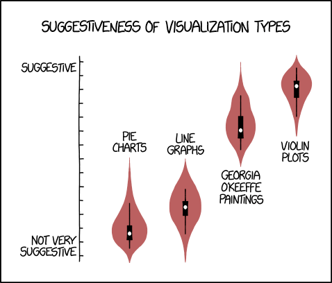

# Problem Set 6: GenAI Agents and Crews

    

## Introduction

Welcome to the module 6! This is the second (out of three) modules on generative AI. In term of *wow factor*, the material you study in this module will far exceed anything you've done so far. The crews that you're going to build in this assignment will baffle and amaze even the most seasoned tech practitioners who are uninitiated with the technology. Here are a few *crews* or tasks you'll be able to get a team of AI agents to do for you fully autonomously:

1. Create a go to market strategy for a product and produce deliverables such as a market research report and digital marketing strategy.
2. Create a career counsellor who looks for jobs on your behalf, analyzes your resume, and creates a new resume tailored to a specific job posting.
3. Replicate a financial analysis division of a large bank that tracks stock price movements, creates a detailed report on stock pricing, offers recommendations, and provides risk guidelines.
4. Create a tour planner that suggests hotels and flights, estimates budget, identifies visa requirements, and designs an entire itinerary.

## Materials

    

In order to build the autonomous crews in this chapter, we will be using a relativelty new but extremely powerful library called [crewAI](https://www.crewai.com/). CrewAI offers both exceptional power right out of the box as well as extreme ease of use. You do not need to be an AI research scientist in order to use it; basic knowledge of Python and prompt engineering are more than sufficient.

There are two resources that I suggest you go through for this module:
1. [Multi AI Agent Systems with crewAI](https://www.deeplearning.ai/short-courses/multi-ai-agent-systems-with-crewai/)- This is a course offered by [deeplearning.ai](https://www.deeplearning.ai/) and taught by the founder of crewAI himself. In this short 2 hour course, Joao Moura will teach you how to set up powerful crews that consist of autonomous agents capable of reasoning about a task,  searching the web to conduct research, collaborating/delegating work to other agents if required.
2. [CrewAI Documentation](https://docs.crewai.com/)- crewAI is a relatively new library so there aren't a lot of tutorials on it (bar the one offered by deeplearning.ai). Fortunately, the documentation for this library is top-class and I'd strongly recommend you walkthrough it to understand how it works. I'd specifically recommend the *How-to Guides* section in the documentation.

### Optional: Read up about AutoGen

CrewAI is so easy to use that I made the decision to launch this module before the module on building full-stack GenAI applications with Langchain (which will now release as module 9). 

However, if you find yourself extremely interested in autonomous agents and crews, and would like to take your skills to the next level, I would suggest taking a look at Microsoft's [Autogen](https://microsoft.github.io/autogen/). It's definitely not as beginner-friendly as crewAI but it comes with more customizability and features. The documentation and deeplearning.ai course, [AI Agentic Design Patterns with AutoGen](https://www.deeplearning.ai/short-courses/ai-agentic-design-patterns-with-autogen/)
 should serve as good places to start.

## Checklist

Before you start with the practice problems, here is a checklist of things you need to complete:
- [ ] OpenAI API Key
- [ ] Problem Sets 0-5

## Practice Problems

### Problem 1: Create a Content Creation Crew

    

Most tech companies (especially ones in education and B2B SaaS) tend to release blog posts about latest technologies that they hope will catch the eye of prospective customers. In order to achieve this, the companies typically employ in-house content writers, freelancers, or content creation companies to research on topics they're interested in, and write articles that are catchy, informative and SEO optimized.

For this problem, your task is to mimic the process above. More specifically, create a crew that taken an article title as an input, and generates a first-draft of aforementioned article. As part of the crew, implement the following agents and their corresponding tasks:

1. **Research Analyst**: Exceptional at conducting researching on a particular topic.
2. **Content Writer**: Writes an article in a given style on a given topic, with constraints in mind (such as number of words)
3. **Editor**: Edits the article and corrects grammatical errors, factual inaccuracies, etc. Also optionally, introduces language that does the job of SEO.

Feel free to add more agents should you feel there is a need to do so.

Once you've created your crew, try authoring the following articles:
1. *Ten Must-Know Functionality of the pandas library*
2. *The Rising Importance of Prompt Engineers*

### Turing Test

Try publishing your articles (either on the topics above or something of your own) on your personal website or blog, and share it with your friends and colleagues. See if they can figure out if the article was actually written by an AI.

### Problem 2: Create a Trip Planner

    

Organizing a trip (especially international ones) can be a hassle. Given your interests, you'd like to have an itinerary that is tailor made for you and within your budget constraints. The *wanderlusts* revel in this activity but for most people, the solution is to either purchase a holiday package which might not cater to your needs or use a travel company/consultant to do the designing and organizing for you at a charge.

For this particular assignment, your task is to create a travel planner that will design a detailed itinerary for you, and give you information on logistics such as hotels & flights you can book, visa process, etc.

You can choose which agents you want to implement for this crew. You can watch this [YouTube CrewAI tutorial](https://www.youtube.com/watch?v=sPzc6hMg7So&t=2010s) for inspiration but my suggestion is get creative and make a planner that is tailor made for you. After all, you can think of this as a dream scenario where you have in your disposal the services of any tourism professional you can think of for next to no cost.

Once you're done, create an itinerary for your dream destination, and share it on the WhatsApp groups! Also, maybe offer to create the itinerary the next time your friends are planning a trip?

### Problem 3: Brand Identity

    

A Designer's job may involve working with clients who are launching a new app, product or service, and helping them with its branding. In other words, you'd come up with a design document that contains a logo, the color palette, the typography, etc.

For the final problem, your task is to simulate the work of a designer and implement two agents that work as a crew:
1. **Market Researcher**: Produces insights about the market in which the client is operating in
2. **Brand Designer**: An expert in producing a design document for an offering in a particular industry and geography.

The *Brand Designer* should be able to use DALL-E to generate the logo for the client. CrewAI does not provide a tool out of the box for this so you'll have to define one yourself.

The final deliverable is a design document that contains the logo, color paletter, typography and other relevant information that you would find in a branding document.

If you're unsure how to go about creating the tool, be sure to attend the office hour on autonomous crews (or watch the recording once that's released).

## Mini Capstone Project

**In order to graduate and be considered an alum, it is mandatory that you submit a mini-capstone project for review**

We've covered a LOT of ground in the first 6 modules, and it is now time for your first major *project*. For this mini-capstone, you can choose from one of the following options. In order to *pass*, it is mandatory that you check all requirements for that particular option. If you have any questions on if your project idea is acceptable, please reach out on the WhatsApp community.

### Option 1: Weave a story with data

    

In this project, you will choose/create a dataset in a field of your choosing, and you will submit a Jupyter notebook that narrates a story about the dataset, and communicates insights or findings that WOW the reader. 

To inspire you here are a few stories that you can use as inspiration:
1. [The World of TED Talks](https://www.kaggle.com/code/rounakbanik/ted-data-analysis)
2. [The Story of Film](https://www.kaggle.com/code/rounakbanik/the-story-of-film)
3. [Insights into the Data Science & ML Industry](https://www.kaggle.com/code/rounakbanik/data-science-faq)

Here are the rules you must follow for your submission to be valid:

1. You must use the `pandas` library for data wrangling.
2. You must generate at least 5 different kinds of visualization using `matplotlib`, `seaborn` or `plotly`.
3. Your dataset should contain at least 1000 rows across files. Toy datasets such as Iris and Titanic are not allowed. 
4. Your document should be at least 1500 words, excluding code snippets.
5. You must not plagiarize work that is already available on a platform like Kaggle. Using the same datasets is okay but the story you narrate must be original.
6. Although not required, you're encouraged to create your own dataset either through web scraping or surveys. If your dataset is deemed valuable, I will help you get more visibility for it on social media.
7. You are encouraged to choose a field that is interesting to you: football, video games, movies, fashion, etc. However, stray away of creating narratives about fictional worlds (for example, *Harry Potter* or *Pokemon* won't make for a strong submission).
8. You can work in teams of up to 3 for this project.
9. Your final submission should be in the form of a public Kaggle notebook.

### Option 2: Create a superstar crew to perform a complex task

    

The second option is to create an autonomous crew of GenAI agents that work together to perform a complex task (i.e what you've learned to do in this module).

As you've seen already, these agents are extremely powerful and can perform super complex tasks with little to no human intervention. Think of a complex problem that you, your friends, or your colleagues solve on a day-to-day bases and assemble a crew that can handle that problem autonomously.

Here are the rules you must follow for your submission to be valid:

1. You must use `crewai` to create your crew.
2. You must use at least three agents as part of your crew. These agents must perform three distinct tasks (or more).
3. You must implement at least one tool from scratch.
4. You can work in teams of up to 3 for this project.
5. Your final submission should be in the form of a 2-5 min video demonstrating how your crew works on real-world inputs.

### Mode of submission

Depending on which option you choose, you will send a Kaggle notebook or a demo video over email to [instructor@thescrappyproject.co](mailto:instructor@thescrappyproject.co). Use `Mini Capstone Project: <Member 1> <Member 2> <Member 3>` as your subject line.

**Also, notify us of your submission on WhatsApp. If you don't do this, we can't guarantee that your submission will be evaluated.**

## Office Hours

In the office hours related to this module, I'll cover the following:
1. Basics of crewAI and approaches for practice problems.
2. Building an autonomous crew for go to strategy.

## Tasks for the week

Deadline for guided cohort: August 31, 2024

- [ ] Complete practice problems and receive/give peer review
- [ ] Mini Capstone Project