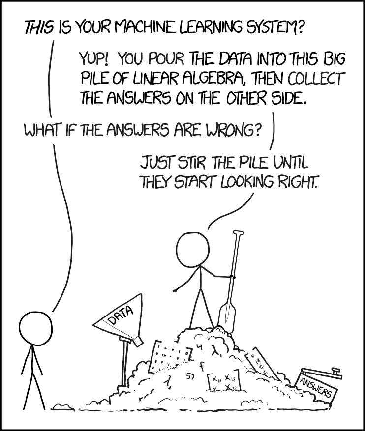
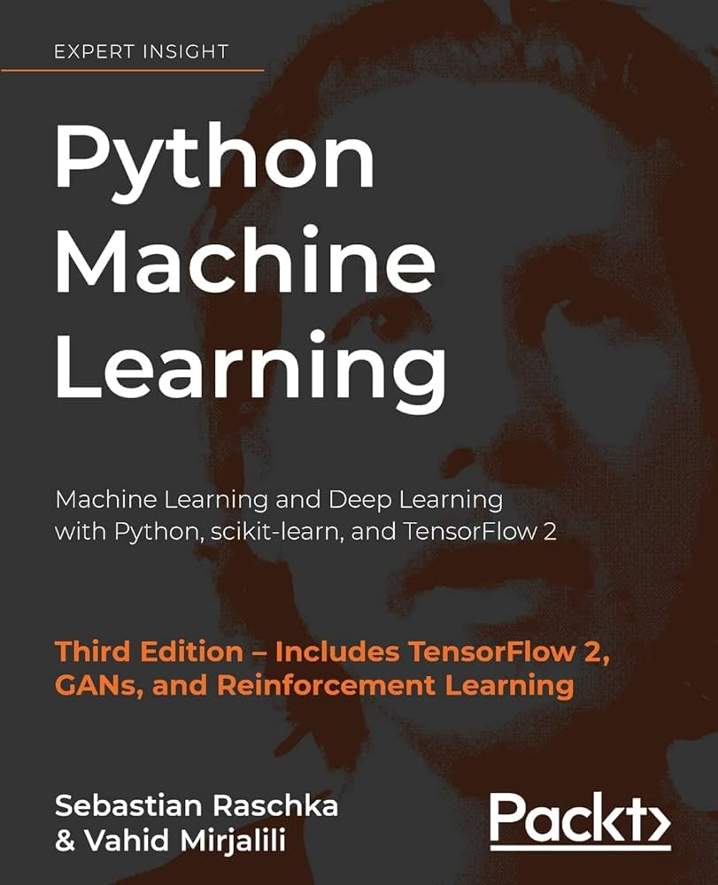
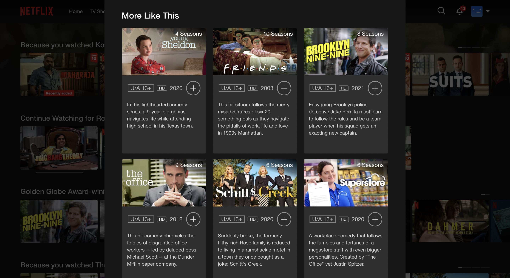
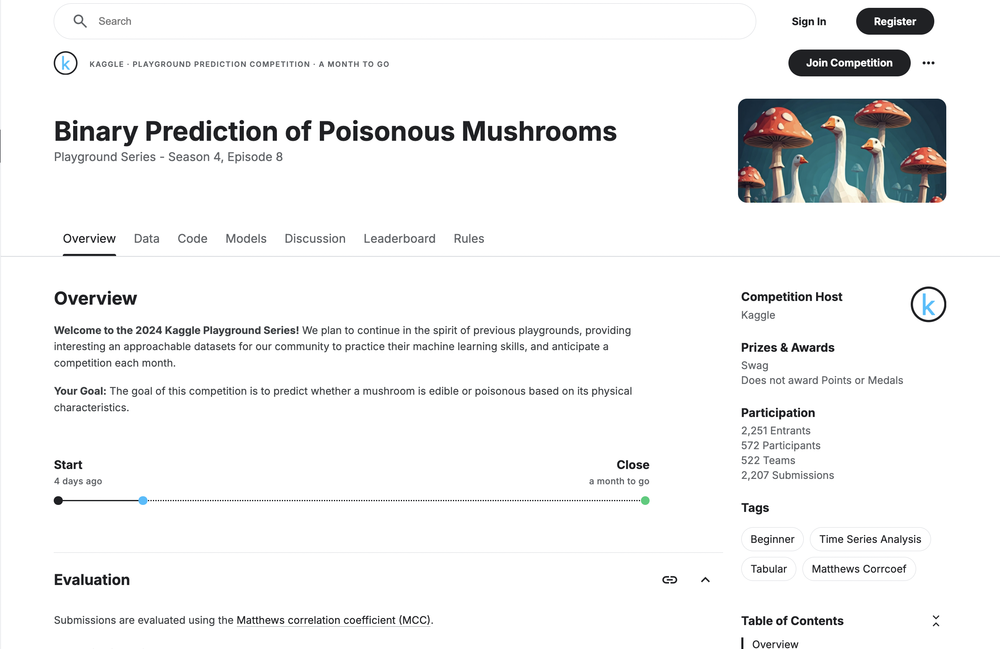

# Problem Set 8: Machine Learning

    

## Introduction

Welcome to the largest module of the course! In this module, we will cover machine learning, a set of techniques that form the bedrock of artificial intelligence. Machine Learning has come a long way from a mostly theoretical discipline to one that has become an integral part of vartious industries, driving innovations and efficiencies that were once unimaginable.

At its core, machine learning is about teaching computers to make predictions/decisions based on data without explicitly explicitly programming how to arrive at said decision. Every digital product that you encounter uses machine learning in some form or the other including:

1. **Recommendation systems** that suggest movies to you on Netflix, what to watch next on YouTube, and songs on Spotify.
2. **Supervised Learning** systems that are deployed to detect credit card fraud, predict house prices in a particular city or state, or create personalized treatment plans for patients.
3. **Unsupervised Learning** systems that are deployed extensively to perform customer segmentation, news categorization, and anomaly detection.
4. **Deep Learning** systems that apply advanced algorithms to power self-driving cars, translate languages, play chess better than the greatest grandmasters, identify tumors, and power applications like ChatGPT.

Machine learning has grown into a massive discipline and these days, you can get specialized master's degrees on the subject. Trying to fit in the core ideas of a such a vast topic into a single module is admittedly an ambitious undertaking but I'm hoping that the targeted material I'll be suggesting combined with the office hour sessions are sufficient to get you started with building systems that amaze you and others around you.

Without any further ado, let's get started!

## Materials

    

Resources on machine learning can tend to be on two extremes: on one hand, you will find [700-page books](https://www.amazon.com/Elements-Statistical-Learning-Prediction-Statistics/dp/0387848576/) that explain the most basic algorithsm in detail and on the other hand, you will find [1500-word articles](https://machinelearningmastery.com/machine-learning-in-python-step-by-step/) that show you how to apply state-of-the-art algorithms in less than 20 lines of code. 

We will have to find a balance between both extremes. While libraries such as `scikit-learn` make it exceptionally easy to prepare data and train advanced models, a theoretical foundation is still important for data science interviews and conversations you'll find yourself in while designing ML systems in a team setting.

Therefore, we are going to take a practical approach to machine learning, with a healthy dose of theory wherever required. As a beginner machine learning practitioner, here are the following ML concepts you should get familiar with:
1. Mathematical Foundations of the Perceptron Model, and creating a Perceptron from scratch.
2. Understand the algorithm, advantages, and disadvatages of the following basic supervised learning techniques:
   - k-nearest neighbours
   - Logistic Regression
   - Support Vector Machines 
   - Decision Trees
   - Random Forests
3. Data Preprocessing: Regularization, imputation, and one-hot encoding.
4. Dimensionality Reduction using PCA and LDA.
5. Model Evaluation Metrics (Accuracy, Precision, Recall, F1, ROC-AUC)
6. Hyperparameter tuning, grid search and model selection.
7. Ensemble Learning using bagging and boosting.
8. Basic Natural Language Processing (n-grams and tf-idf models)
9. Linear regression
10. Unsupervised learning algorithms such as k-means clustering and DBSCAN.

That is admittedly a lot to cover. I recommend the following resources to learn about these topics:

1. [Machine Learning Mastery](https://machinelearningmastery.com/) by Jason Brownlee, is in my opinion, the best blog on applied machine learning on the internet. Jason has amazing articles on every ML topic that you could want to know about as a beginner. I'd suggest starting off by reading the following articles.
   -  [Your First Machine Learning Project in Python Step-by-Step](https://machinelearningmastery.com/machine-learning-in-python-step-by-step/)
   -  [Supervised and Unsupervised Machine Learning Algorithms](https://machinelearningmastery.com/supervised-and-unsupervised-machine-learning-algorithms/)
   -  [Using Machine Learning in Customer Segmentation](https://machinelearningmastery.com/using-machine-learning-in-customer-segmentation/)
2. [Python Machine Learning](https://www.amazon.com/Python-Machine-Learning-scikit-learn-TensorFlow/dp/1789955750/) by Sebastian Raschka was my go-to book for developing a theoretical foundation of machine learning. Unlike most other ML textbooks, Raschka ensures that the reader is not bogged down by mathematics and has plenty of code snippets to play with. I used the 2nd edition and I recommend readings all chapters except the ones on building a web application and a neural network (we will cover this in a later module).
3. [Machine Learning with Python: A Practical Introduction](https://www.edx.org/learn/machine-learning/ibm-machine-learning-with-python-a-practical-introduction) is a course by IBM available on edX that covers most of the topics highlighted above.

Machine learning is one subject where there really isn't a dearth of learning material, both free and paid. Feel free to consult other resources to learn about the topics listed above should you feel the teaching style of any of my resources are not aligned with your tastes. 

## Checklist

Before you start with the practice problems, here is a checklist of things you need to complete:
- [ ] Problem Sets 0-7
- [ ] Mini Capstone Project

## Practice Problems

### Problem 1: The Titanic

    

A rite of passage for a lot of data scientists around the world is the Titanic classification problem. This problem is usually considered the *Hello World* of Machine Learning.

As you may know, the Titanic was a massive ship that sunk on its maiden voyage in 1912. You're given a dataset with all the passengers that were on the Titanic and your task is to build a machine learning model that predicts if a given passenger survived with an 80% accuracy.

You can find the data and relevant context on Kaggle [here](https://www.kaggle.com/competitions/titanic). Be sure to perform the necessary data wrangling, feature engineering, hyperparameter tuning, and reporting while building your model.

### Problem 2: Boston Housing

    

Titanic is a *classification* problem. In the Boston housing problem, you're required to build a *regression model* that is capable of predicting house prices in a certain area. A regression model implies that the prediction is a continuous variable (price) as opposed to a discrete one (deceased/survived).

As with Titanic, set up an ML project to build this model. Experiment with models such as Linear Regression and Gradient Boosting, and discover which models perform better, on average. You will find more context and data on the [Kaggle page](https://www.kaggle.com/competitions/house-prices-advanced-regression-techniques). 

### Problem 3: Cerebral Stroke Prediction

In the real world, a very common problem you'll encounter while building models is imbalanced datasets. These are datasets where the positive class is a tiny fraction of the entire dataset (1-10%). In such cases, a standard ML model might learn to predict *negative* for every observation and get away with a 90%+ accuracy. 

This is obviously not what we want. In this problem, we will use an imbalanced dataset to create an ML model that predicts a cerebral stroke. You can find the dataset for this problem [here](https://www.kaggle.com/datasets/shashwatwork/cerebral-stroke-predictionimbalaced-dataset/data).

As you attempt to build the model, think about what metric is more approprate for determining your model's performance. Achieve a performance of >70% for your chosen metric (hint: it's not accuracy)

You will find the following articles helpful for this problem:
- [8 Tactics to Combat Imbalanced Classes in Your Machine Learning Dataset](https://machinelearningmastery.com/tactics-to-combat-imbalanced-classes-in-your-machine-learning-dataset/)
- [10 Techniques to Solve Imbalanced Classes in Machine Learning](https://www.analyticsvidhya.com/blog/2020/07/10-techniques-to-deal-with-class-imbalance-in-machine-learning/)

### Problem 4: Movie Recommendation Systems

    

Recommendation systems are everywhere, whether you're trying to find out what movie to watch next, what song to listen to, what book to read, or what item to purchase. In this problem, you will create recommendation systems that suggest movies based on movie's characteristics (content-based) and its ratings (collaborative filtering). You will use the movies dataset available [here](https://www.kaggle.com/datasets/rounakbanik/the-movies-dataset).

Both systems are covered in detail in the IBM course. However, if you don't feel like taking the course, you can use the Kaggle notebook available [here](https://www.kaggle.com/code/rounakbanik/movie-recommender-systems) as a gentle introduction on the subject.

I will also be conducting an office hour on recommendation systems so make sure you attend the session/view the recording if you're interested in diving deeper into this subject.

### Problem 5: Live Kaggle Competition

    

Your final task for this problem set is to participate in a Kaggle Playground Series competition. Kaggle conducts a beginner-friendly competition every month where you can compete with people around the world in building ML models.

At the time of publication of this module, we were at [Season 4 Episode 8](https://www.kaggle.com/competitions/playground-series-s4e8) where you're required to figure out if a particular mushroom is edible or poisonous.

Regardless of when you're reading this, there should be a similar competition available live where you can compete on a leaderboard. Join such a competition and put your ML skills to the test!

## Office Hours

In the office hours related to this module, I'll cover the following:
1. Setting up an ML project from scratch.
2. Building Recommendation Systems.
3. How to compete in a Kaggle competition.

## Tasks for the week

Deadline for guided cohort: October 31, 2024

- [ ] Complete practice problems and receive/give peer review