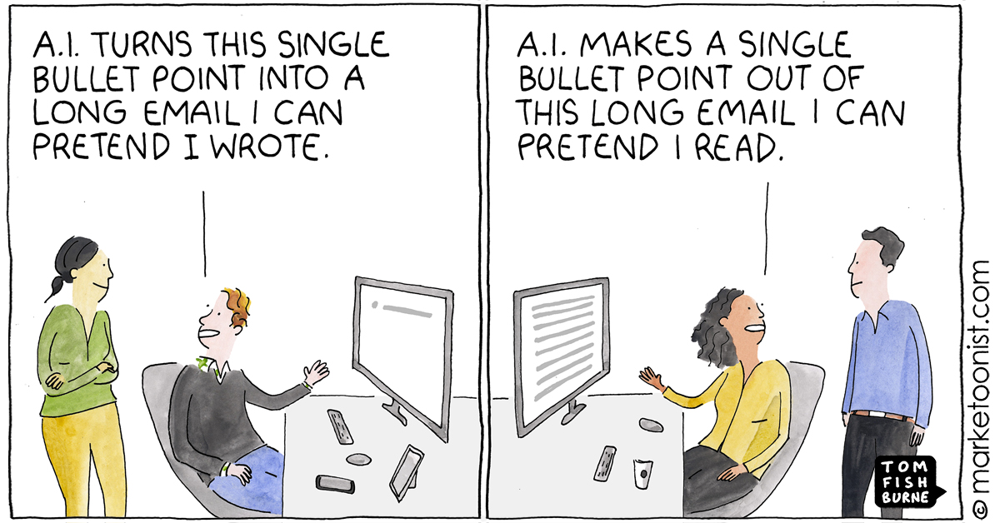

# Problem Set 9: GenAI Application Development

    

## Introduction

TBD

## Materials

TBD

## Checklist

Before you start with the practice problems, here is a checklist of things you need to complete:
- [ ] Problem Sets 0-8
- [ ] Mini Capstone Project

## Practice Problems

TBD

## Office Hours

In the office hours related to this module, I'll cover the following:
1. Designing a RAG system from scratch.
2. Solution approaches to practice problems.

## Tasks for the week

Deadline for guided cohort: October 31, 2024

- [ ] Complete practice problems and receive/give peer review